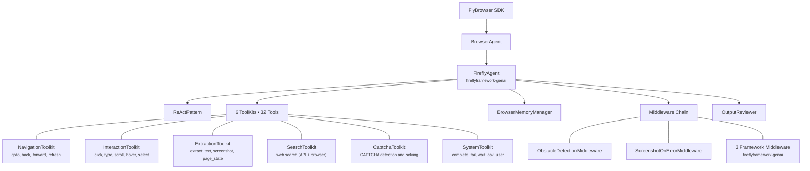

<div align="center">

```
  _____.__         ___.
_/ ____\  | ___.__.\_ |_________  ______  _  ________ ___________
\   __\|  |<   |  | | __ \_  __ \/  _ \ \/ \/ /  ___// __ \_  __ \
 |  |  |  |_\___  | | \_\ \  | \(  <_> )     /\___ \\  ___/|  | \/
 |__|  |____/ ____| |___  /__|   \____/ \/\_//____  >\___  >__|
            \/          \/                        \/     \/
```

**LLM-powered browser automation that speaks your language.**

[](https://github.com/fireflyresearch/flybrowser/releases)
[](https://www.python.org/downloads/)
[](https://opensource.org/licenses/Apache-2.0)
[](https://docs.astral.sh/ruff/)

[Documentation](https://flybrowser.dev/docs) &bull; [GitHub](https://github.com/fireflyresearch/flybrowser) &bull; [Discord](https://discord.gg/flybrowser) &bull; [Examples](examples/)

</div>

---

FlyBrowser combines Playwright's bulletproof browser control with LLM intelligence, letting you automate the web using plain English instead of brittle CSS selectors. Built on [fireflyframework-genai](https://github.com/fireflyframework/fireflyframework-genai) -- Firefly's open-source agent framework -- FlyBrowser inherits production-grade ReAct reasoning, multi-provider LLM support, and a composable toolkit system.

Write automation in Python, interact through the CLI, or deploy as a scalable REST API server. Same operations everywhere.

```python
from flybrowser import FlyBrowser

async with FlyBrowser(llm_provider="openai", api_key="sk-...") as browser:
    await browser.goto("https://shop.example.com")
    await browser.act("click the Electronics category")
    products = await browser.extract("Get all product names and prices")
    await browser.agent("Add the cheapest item to the cart and go to checkout")
```

```bash
flybrowser goto https://shop.example.com
flybrowser act "click the Electronics category"
flybrowser extract "Get all product names and prices"
flybrowser agent "Add the cheapest item to the cart and go to checkout"
```

---

## Table of Contents

- [Key Features](#key-features)
- [Quick Start](#quick-start)
- [SDK API Reference](#sdk-api-reference)
- [CLI Quick Reference](#cli-quick-reference)
- [Deployment Modes](#deployment-modes)
- [Architecture](#architecture)
- [LLM Providers](#llm-providers)
- [Stealth Mode](#stealth-mode)
- [PII Protection](#security--pii-protection)
- [Streaming & Recording](#streaming--recording)
- [Observability](#observability)
- [Configuration](#configuration)
- [Documentation](#documentation)
- [Development](#development)
- [Contributing](#contributing)
- [License](#license)

---

## Key Features

| Category | Highlights |
|----------|------------|
| **Natural Language Control** | Describe actions in plain English -- FlyBrowser reasons through multi-step tasks using the ReAct loop |
| **Structured Extraction** | Extract data with optional JSON Schema validation and automatic LLM-based correction (99.8% success rate) |
| **Autonomous Agent** | Give a complex goal, set `max_iterations`, and let the agent plan and execute across pages |
| **Stealth Mode** | Fingerprint generation, CAPTCHA solving (reCAPTCHA, hCaptcha, Turnstile), proxy rotation |
| **PII Protection** | Encrypted credential storage with placeholder-based LLM injection -- passwords never reach the model |
| **Live Streaming** | Stream browser sessions in real-time via HLS, DASH, or RTMP with H.264/H.265/VP9 codecs |
| **Recording** | Record sessions locally or to S3, with hardware-accelerated encoding (NVENC, VideoToolbox, QSV) |
| **Multi-Deployment** | Embedded in scripts, standalone REST server (FastAPI), or distributed cluster with Raft consensus |
| **Observability** | OpenTelemetry tracing, Prometheus metrics, live view iframe, interactive completion page |
| **Multi-Provider LLM** | OpenAI, Anthropic, Google Gemini, Qwen, Ollama, or any OpenAI-compatible endpoint |
| **32 Browser Tools** | 6 ToolKits covering navigation, interaction, extraction, search, CAPTCHA, and system operations |
| **Cost Tracking** | Per-request token counts and cost estimates via `return_metadata=True` and `get_usage_summary()` |

---

## Quick Start

### Installation

```bash
# Recommended: one-liner
curl -fsSL https://get.flybrowser.dev | bash

# Or from source
git clone https://github.com/fireflyresearch/flybrowser.git
cd flybrowser && ./install.sh
```

### Guided Setup

```bash
# Interactive wizard -- configures LLM provider, server, observability, and security
flybrowser setup

# Or run individual steps
flybrowser setup quick          # Minimal setup
flybrowser setup llm            # Configure LLM provider
flybrowser setup server         # Configure server mode
flybrowser setup observability  # Tracing and metrics
flybrowser setup security       # RBAC and JWT
flybrowser setup verify         # Validate installation
```

### Your First Automation

```python
import asyncio
from flybrowser import FlyBrowser

async def main():
    async with FlyBrowser(
        llm_provider="openai",
        api_key="sk-...",
    ) as browser:
        await browser.goto("https://news.ycombinator.com")

        stories = await browser.extract(
            "Get the top 5 post titles and their scores",
            schema={
                "type": "array",
                "items": {
                    "type": "object",
                    "properties": {
                        "title": {"type": "string"},
                        "score": {"type": "integer"},
                    },
                },
            },
        )

        if stories.success:
            for s in stories.data:
                print(f"{s['title']} -- {s['score']} points")
            stories.pprint()  # execution summary with LLM usage and cost

asyncio.run(main())
```

### Interactive REPL

```bash
flybrowser repl
```

```
flybrowser> goto https://example.com
flybrowser> extract What is the main heading?
flybrowser> act click the More information link
flybrowser> screenshot
flybrowser> quit
```

---

## SDK API Reference

The `FlyBrowser` class is an async context manager. Every method below works identically in embedded, standalone, and cluster modes.

### Navigation

| Method | Description |
|--------|-------------|
| `goto(url, wait_until="domcontentloaded")` | Navigate directly to a URL |
| `navigate(instruction, context=None, use_vision=True)` | Navigate using natural language |

### Actions & Interaction

| Method | Description |
|--------|-------------|
| `act(instruction, context=None, use_vision=True, return_metadata=True, max_iterations=10)` | Perform browser actions via natural language |
| `observe(query, context=None, return_selectors=True, return_metadata=True, max_iterations=10)` | Find and analyze elements on the page |

### Data Extraction

| Method | Description |
|--------|-------------|
| `extract(query, context=None, use_vision=False, schema=None, return_metadata=True, max_iterations=15)` | Extract structured data with optional JSON Schema validation |
| `search(query, search_type="auto", max_results=10, ranking="auto", return_metadata=True)` | Web search via API providers (Serper, Google, Bing) with browser fallback |

### Autonomous Agent

| Method | Description |
|--------|-------------|
| `agent(task, context=None, max_iterations=50, max_time_seconds=1800.0, return_metadata=True)` | Execute complex multi-step goals autonomously |
| `execute_task(task)` | Execute a single task with full ReAct reasoning |

### Batch & Pipeline

| Method | Description |
|--------|-------------|
| `batch_execute(tasks, parallel=False, stop_on_failure=False)` | Run multiple tasks sequentially or in parallel |

### Streaming & Recording

| Method | Description |
|--------|-------------|
| `start_stream(protocol="hls", quality="high", ...)` | Start live stream (HLS, DASH, or RTMP) |
| `start_recording()` / `stop_recording()` | Record browser session to video |
| `screenshot(full_page=False, mask_pii=True)` | Capture page screenshot |

### Security & PII

| Method | Description |
|--------|-------------|
| `store_credential(name, value, pii_type="password")` | Store encrypted credential |
| `secure_fill(selector, credential_id, clear_first=True)` | Fill form field without exposing value to LLM |
| `mask_pii(text)` | Mask PII patterns (email, phone, SSN, credit card, etc.) |

### Usage & Diagnostics

| Method | Description |
|--------|-------------|
| `get_usage_summary()` | Token counts, cost breakdown, and API call statistics |

All action methods return an `AgentRequestResponse` with `.success`, `.data`, `.llm_usage`, `.execution`, and a `.pprint()` method for human-readable output.

---

## CLI Quick Reference

```
flybrowser <command> [options]
```

### Core Commands

| Command | Description |
|---------|-------------|
| `flybrowser repl` | Interactive REPL session |
| `flybrowser goto <url>` | Navigate to URL |
| `flybrowser act <instruction>` | Perform a browser action |
| `flybrowser extract <query>` | Extract data from current page |
| `flybrowser observe <query>` | Find page elements |
| `flybrowser agent <task>` | Run autonomous agent |
| `flybrowser screenshot` | Capture screenshot |
| `flybrowser run <workflow.yaml>` | Execute a YAML pipeline |

### Session Management

| Command | Description |
|---------|-------------|
| `flybrowser session create` | Create a new browser session |
| `flybrowser session list` | List active sessions |
| `flybrowser session info <id>` | Session details |
| `flybrowser session connect <id>` | Attach to a running session |
| `flybrowser session exec <id> <cmd>` | Execute command in session |
| `flybrowser session close <id>` | Close a session |
| `flybrowser session close-all` | Close all sessions |

### Server & Streaming

| Command | Description |
|---------|-------------|
| `flybrowser serve` | Start the REST API server |
| `flybrowser stream start\|stop\|status\|url\|play\|web` | Manage live streams |
| `flybrowser recordings list\|download\|delete\|clean` | Manage recordings |

### Setup & Diagnostics

| Command | Description |
|---------|-------------|
| `flybrowser setup [quick\|llm\|server\|observability\|security\|verify]` | Guided configuration |
| `flybrowser doctor` | Check installation health |
| `flybrowser version` | Print version info |
| `flybrowser uninstall` | Remove FlyBrowser |

---

## Deployment Modes

FlyBrowser runs in three modes. The Python SDK API is identical across all of them -- only initialization differs.

### Embedded

Everything runs in-process. Ideal for scripts, notebooks, and development.

```python
async with FlyBrowser(llm_provider="openai", api_key="sk-...") as browser:
    await browser.goto("https://example.com")
    data = await browser.extract("Get the main content")
```

### Standalone Server

FlyBrowser runs as a FastAPI HTTP server. Multiple clients create and manage browser sessions over REST.

```bash
flybrowser serve --port 8000
```

```python
async with FlyBrowser(endpoint="http://localhost:8000") as browser:
    await browser.goto("https://example.com")
    data = await browser.extract("Get the main content")
```

### Cluster

Multiple nodes coordinate via Raft consensus for high availability, automatic session failover, and load-balanced auto-scaling.

```bash
flybrowser serve --cluster --node-id node1 --port 8001 --raft-port 5001
flybrowser serve --cluster --node-id node2 --port 8002 --raft-port 5002 --peers node1:5001
flybrowser serve --cluster --node-id node3 --port 8003 --raft-port 5003 --peers node1:5001,node2:5002
```

### Comparison

| Capability | Embedded | Standalone | Cluster |
|------------|----------|------------|---------|
| Browser sessions | 1 | Configurable pool | Auto-scaled pool |
| API access | Python only | REST + Python | REST + Python |
| Recording storage | Local | Local / S3 / NFS | S3 / NFS |
| Live streaming | Local server | Full support | Full support |
| Failover | N/A | N/A | Automatic (< 100 ms) |
| RBAC | N/A | JWT (admin, operator, viewer) | JWT (admin, operator, viewer) |
| Best for | Scripts, dev, notebooks | Teams, microservices | Production at scale |

---

## Architecture

FlyBrowser is built on [fireflyframework-genai](https://github.com/fireflyframework/fireflyframework-genai), which provides the agent runtime, reasoning patterns, tool registration, memory management, and LLM provider abstraction. FlyBrowser contributes browser-specific toolkits, middleware, and the SDK surface.



### Key architectural details

- **Reasoning patterns**: ReAct (default), PlanAndExecute, and Reflexion -- configurable per task.
- **5-layer middleware chain**: 3 middleware layers from fireflyframework-genai plus 2 browser-specific layers (obstacle detection, screenshot-on-error).
- **Dual-write memory**: `BrowserMemoryManager` maintains page history, navigation graphs, and obstacle caches, and syncs state to the framework's `MemoryManager`.
- **OutputReviewer**: Validates extracted data against JSON Schema with a 5-stage pipeline (direct parse, code block extraction, pattern matching, best-effort parse, LLM correction).
- **DAG-based parallel exploration**: When navigating entire sites, an `ExplorationDAG` tracks page dependencies and enables pipelined screenshot capture + parallel LLM analysis for 2-4x speedup.

---

## LLM Providers

LLM orchestration is handled entirely by [fireflyframework-genai](https://github.com/fireflyframework/fireflyframework-genai). FlyBrowser passes `llm_provider` and `llm_model` to the framework, which manages provider creation, API calls, retries, and streaming.

| Provider | Models | Vision | Config |
|----------|--------|--------|--------|
| **OpenAI** | `gpt-5.2`, `gpt-5-mini`, `gpt-4o`, `gpt-4o-mini` | Yes | `llm_provider="openai"` |
| **Anthropic** | `claude-sonnet-4-5-20250929`, `claude-3-5-sonnet-20241022` | Yes | `llm_provider="anthropic"` |
| **Google Gemini** | `gemini-2.0-flash`, `gemini-1.5-pro` | Yes | `llm_provider="gemini"` |
| **Qwen (Alibaba)** | `qwen3`, `qwen-plus`, `qwen-vl` | Yes (qwen-vl) | `llm_provider="qwen"` |
| **Ollama (local)** | `qwen3`, `llama3.2`, `gemma3`, etc. | Model-dependent | `llm_provider="ollama"` |
| **Custom** | Any OpenAI-compatible endpoint | Varies | `llm_provider="openai"` + `base_url` |

```python
# OpenAI
browser = FlyBrowser(llm_provider="openai", llm_model="gpt-5.2", api_key="sk-...")

# Anthropic
browser = FlyBrowser(llm_provider="anthropic", llm_model="claude-sonnet-4-5-20250929", api_key="sk-ant-...")

# Google Gemini
browser = FlyBrowser(llm_provider="gemini", llm_model="gemini-2.0-flash", api_key="AIza...")

# Qwen (DashScope)
browser = FlyBrowser(llm_provider="qwen", llm_model="qwen-plus", api_key="sk-...")

# Local via Ollama (no API key needed)
browser = FlyBrowser(llm_provider="ollama", llm_model="qwen3:8b")
```

---

## Stealth Mode

Bypass bot detection with fingerprint generation, CAPTCHA solving, and intelligent proxy rotation.

```python
from flybrowser import FlyBrowser
from flybrowser.stealth import StealthConfig

async with FlyBrowser(
    llm_provider="openai",
    api_key="sk-...",
    stealth_config=StealthConfig(
        fingerprint_enabled=True,           # Chrome/Firefox/Safari on Windows/macOS/Linux
        captcha_enabled=True,               # reCAPTCHA v2/v3, hCaptcha, Turnstile, FunCaptcha
        captcha_provider="2captcha",        # 2captcha, anti-captcha, capsolver
        captcha_api_key="your-key",
        proxy_enabled=True,                 # Residential, datacenter, mobile, ISP
    ),
) as browser:
    await browser.goto("https://protected-site.com")
    result = await browser.agent("Complete the signup form")
```

**Fingerprints**: User agent, screen resolution, timezone, language, WebGL/Canvas/Audio fingerprints, fonts, plugins, and hardware info -- all internally consistent per generated identity.

**Proxy rotation strategies**: round-robin, random, least-used, best-performance, geographic.

**Human-like behavior**: Randomized delays, natural mouse movement curves, and realistic typing cadence.

---

## Security & PII Protection

Credentials are encrypted at rest and injected into form fields via placeholders -- the LLM never sees the actual values.

```python
# Store credentials (AES-encrypted, memory-zeroed on deletion)
pwd_id = browser.store_credential("password", "secret123", pii_type="password")

# Fill form field securely -- LLM sees {{CREDENTIAL:password}}, not the value
await browser.secure_fill("#password", pwd_id)

# Automatic PII masking in all LLM-bound text
masked = browser.mask_pii("Contact me at john@example.com or 555-123-4567")
# "Contact me at [MASKED_EMAIL] or [MASKED_PHONE]"
```

**Auto-detected PII types**: email addresses, phone numbers, Social Security numbers, credit card numbers, and custom regex patterns.

**RBAC** (standalone/cluster): Three roles -- `admin`, `operator`, `viewer` -- enforced via JWT tokens.

---

## Streaming & Recording

### Live Streaming

```python
stream = await browser.start_stream(protocol="hls", quality="high", codec="h265")
print(f"Watch: {stream['stream_url']}")
print(f"Web player: {stream['player_url']}")
```

```bash
flybrowser stream start sess_123 --protocol hls --quality high
flybrowser stream web sess_123    # Open built-in web player
flybrowser stream play sess_123   # Launch local player (ffplay/vlc/mpv)
```

**Protocols**: HLS, DASH, RTMP (stream to Twitch/YouTube). **Codecs**: H.264, H.265 (40% bandwidth savings), VP9. **Hardware acceleration**: NVIDIA NVENC, Apple VideoToolbox (M-series), Intel QSV.

### Recording

```python
await browser.start_recording()
await browser.act("demonstrate the checkout process")
recording = await browser.stop_recording()
```

```bash
flybrowser recordings list
flybrowser recordings download rec_xyz -o session.mp4
flybrowser recordings clean --older-than 30d
```

---

## Observability

FlyBrowser integrates OpenTelemetry tracing, Prometheus metrics, and a built-in `UsageTracker` for cost monitoring.

```python
from flybrowser.observability import ObservabilityConfig

browser = FlyBrowser(
    llm_provider="openai",
    api_key="sk-...",
    observability_config=ObservabilityConfig(
        enable_command_logging=True,
        enable_source_capture=True,
        enable_live_view=True,
        live_view_port=8765,
    ),
)
```

**Command logging**: Full operation history with LLM prompt/response capture, exportable to JSON or SQLite.

**Live View**: WebSocket-based real-time browser view, embeddable as an iframe (`http://localhost:8765/embed`).

**Completion page**: In non-headless mode, `agent()` renders an interactive summary with metrics (duration, iterations, tokens, cost), a reasoning timeline, tool execution details, and a collapsible JSON tree explorer for results.

---

## Configuration

```python
browser = FlyBrowser(
    # LLM
    llm_provider="openai",
    llm_model="gpt-4o",
    api_key="sk-...",

    # Browser
    headless=True,
    browser_type="chromium",
    timeout=30.0,

    # Behavior
    speed_preset="balanced",       # fast, balanced, thorough
    pii_masking_enabled=True,
    recording_enabled=False,

    # Display
    pretty_logs=True,
    log_verbosity="normal",        # silent, minimal, normal, verbose, debug
)
```

All options can also be set via environment variables with a `FLYBROWSER_` prefix:

```bash
export FLYBROWSER_LLM_PROVIDER=openai
export FLYBROWSER_LLM_MODEL=gpt-4o
export FLYBROWSER_API_KEY=sk-...
export FLYBROWSER_HEADLESS=true
```

See [Configuration Reference](docs/reference/configuration.md) for the full list of options, storage configuration (local, S3, NFS), and cluster settings.

---

## Documentation

Full documentation is available at [flybrowser.dev/docs](https://flybrowser.dev/docs) and in the [`docs/`](docs/) directory.

### Getting Started

| Guide | Description |
|-------|-------------|
| [Installation](docs/getting-started/installation.md) | System requirements and installation methods |
| [Quickstart](docs/getting-started/quickstart.md) | Your first automation in five minutes |
| [Core Concepts](docs/getting-started/concepts.md) | Sessions, actions, and the ReAct framework |
| [Setup Wizard](docs/getting-started/setup-wizard.md) | Interactive configuration guide |

### Features

| Feature | Description |
|---------|-------------|
| [Act](docs/features/act.md) | Execute actions -- click, type, scroll, select |
| [Extract](docs/features/extract.md) | Extract structured data with JSON Schema validation |
| [Agent](docs/features/agent.md) | Multi-step autonomous tasks |
| [Observe](docs/features/observe.md) | Find and analyze page elements |
| [Navigation](docs/features/navigation.md) | URL and natural language navigation |
| [Search](docs/features/search.md) | Multi-provider web search with intelligent ranking |
| [Obstacle Detection](docs/features/obstacle-detection.md) | Automatic popup, modal, and cookie banner dismissal |
| [Screenshots](docs/features/screenshots.md) | Capture and compare screenshots |
| [Streaming](docs/features/streaming.md) | HLS, DASH, and RTMP live streaming |
| [PII Handling](docs/features/pii.md) | Encrypted credential storage and auto-masking |
| [Stealth Mode](docs/features/stealth.md) | Fingerprints, CAPTCHA solving, proxy rotation |
| [Observability](docs/features/observability.md) | Logging, live view, completion page, tracing |

### Guides

| Guide | Description |
|-------|-------------|
| [Basic Automation](docs/guides/basic-automation.md) | Navigation, clicking, typing, scrolling |
| [Data Extraction](docs/guides/data-extraction.md) | Scraping and extraction techniques |
| [Form Automation](docs/guides/form-automation.md) | Form filling and submission |
| [Multi-Page Workflows](docs/guides/multi-page-workflows.md) | Complex navigation flows |
| [Authentication](docs/guides/authentication.md) | Login and session handling |
| [Error Handling](docs/guides/error-handling.md) | Retry and recovery patterns |
| [Context Usage](docs/guides/context-usage.md) | Passing context to operations |

### CLI

| Reference | Description |
|-----------|-------------|
| [CLI Reference](docs/reference/cli.md) | Full command-line reference |
| [Direct Commands](docs/cli/direct-commands.md) | `goto`, `act`, `extract`, `agent`, `screenshot` |
| [Session Management](docs/cli/session-management.md) | `session create`, `list`, `connect`, `close` |
| [Pipelines](docs/cli/pipelines.md) | YAML workflow pipelines with `run` |

### Reference

| Reference | Description |
|-----------|-------------|
| [SDK Reference](docs/reference/sdk.md) | Complete Python API documentation |
| [REST API](docs/reference/rest-api.md) | HTTP endpoint documentation |
| [Configuration](docs/reference/configuration.md) | All configuration options |

### Architecture

| Topic | Description |
|-------|-------------|
| [Overview](docs/architecture/overview.md) | System architecture |
| [Framework Integration](docs/architecture/framework-integration.md) | fireflyframework-genai integration |
| [ReAct Framework](docs/architecture/react.md) | Reasoning and acting loop |
| [Tools System](docs/architecture/tools.md) | ToolKit architecture and 32 browser tools |
| [Memory Management](docs/architecture/memory.md) | BrowserMemoryManager and dual-write sync |
| [LLM Integration](docs/architecture/llm-integration.md) | Provider delegation to fireflyframework-genai |
| [Response Validation](docs/architecture/validation.md) | OutputReviewer and 5-stage validation pipeline |
| [Context System](docs/architecture/context.md) | Context building and prompt management |
| [Security](docs/architecture/security.md) | RBAC, JWT, encryption, PII architecture |

### Deployment

| Mode | Description |
|------|-------------|
| [Embedded](docs/deployment/embedded.md) | Run in your Python process |
| [Standalone](docs/deployment/standalone.md) | HTTP server deployment |
| [Cluster](docs/deployment/cluster.md) | Multi-node distributed setup with Raft |
| [Docker](docs/deployment/docker.md) | Container deployment |
| [Kubernetes](docs/deployment/kubernetes.md) | K8s orchestration |

### Advanced

| Topic | Description |
|-------|-------------|
| [Custom Tools](docs/advanced/custom-tools.md) | Extend with custom browser tools |
| [Custom Providers](docs/advanced/custom-providers.md) | Add LLM providers |
| [Performance](docs/advanced/performance.md) | Optimization techniques |
| [Troubleshooting](docs/advanced/troubleshooting.md) | Debug and resolve issues |

### Examples

| Category | Description |
|----------|-------------|
| [Examples Overview](docs/examples/index.md) | Guide to all example code |
| [Web Scraping](docs/examples/web-scraping.md) | Data extraction examples |
| [UI Testing](docs/examples/ui-testing.md) | Automated testing examples |
| [Workflow Automation](docs/examples/workflow-automation.md) | End-to-end business automation |

---

## Development

```bash
# Install with dev dependencies
./install.sh --dev

# Run tests
task test

# Code quality (format, lint, typecheck)
task check

# Pre-commit checks
task precommit

# Development server with auto-reload
task serve
```

| Task | Description |
|------|-------------|
| `task install` | Install (auto-detects uv/pip) |
| `task install:dev` | Install with dev dependencies |
| `task dev` | Start development environment |
| `task repl` | Launch interactive REPL |
| `task serve` | Start dev server with reload |
| `task test` | Run all tests |
| `task test:cov` | Tests with coverage report |
| `task check` | Format, lint, typecheck |
| `task precommit` | Full pre-commit checks |
| `task doctor` | Check installation health |
| `task build` | Build distribution packages |

---

## Contributing

```bash
# Fork and clone
git clone https://github.com/your-username/flybrowser.git
cd flybrowser

# Create a branch
git checkout -b feature/your-feature

# Install, make changes, and verify
./install.sh --dev
task check && task test

# Commit and open a PR
git commit -m "Add your feature"
git push origin feature/your-feature
```

See [Architecture Overview](docs/architecture/overview.md) for details on how the codebase is structured.

---

## License

Copyright 2026 Firefly Software Solutions Inc.

Licensed under the Apache License, Version 2.0. See [LICENSE](LICENSE) for the full text.

---

## Acknowledgments

Built on:

- [fireflyframework-genai](https://github.com/fireflyframework/fireflyframework-genai) -- Firefly's open-source agent framework (FireflyAgent, ReActPattern, ToolKit, MemoryManager)
- [Playwright](https://playwright.dev/) -- Browser automation engine
- [Pydantic AI](https://ai.pydantic.dev/) -- Type-safe LLM agent framework (used internally by fireflyframework-genai)
- [FastAPI](https://fastapi.tiangolo.com/) -- REST API framework
- [FFmpeg](https://ffmpeg.org/) -- Video encoding

Inspired by [Stagehand](https://github.com/browserbase/stagehand).

---

<p align="center">
  <strong>Made with care by <a href="https://flybrowser.dev">Firefly Software Solutions Inc</a></strong>
</p>

<p align="center">
  <a href="https://flybrowser.dev">Website</a> &bull;
  <a href="https://github.com/fireflyresearch/flybrowser">GitHub</a> &bull;
  <a href="https://discord.gg/flybrowser">Discord</a> &bull;
  <a href="https://twitter.com/flybrowser">Twitter</a>
</p>
