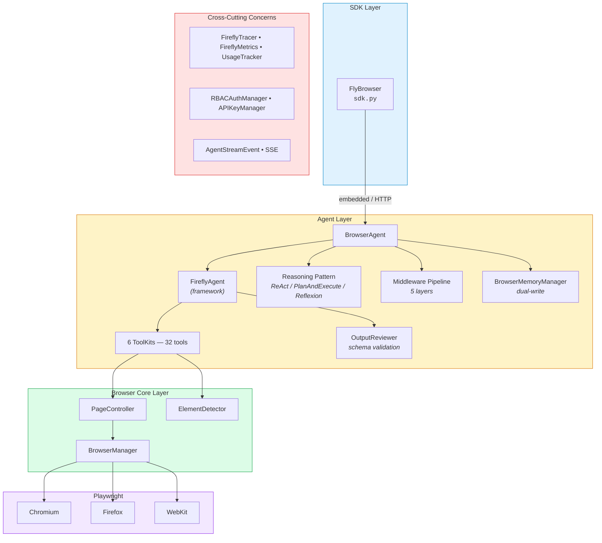
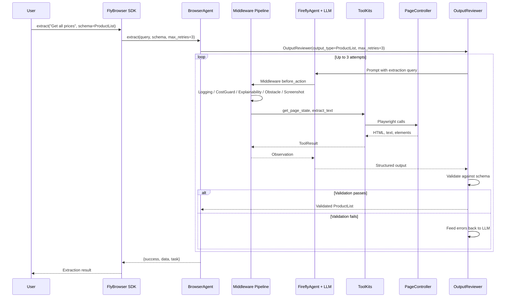
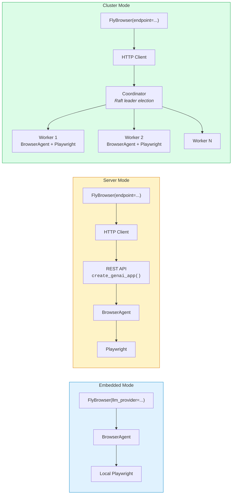

<!--
Copyright 2026 Firefly Software Solutions Inc

Licensed under the Apache License, Version 2.0 (the "License");
you may not use this file except in compliance with the License.
You may obtain a copy of the License at

    http://www.apache.org/licenses/LICENSE-2.0

Unless required by applicable law or agreed to in writing, software
distributed under the License is distributed on an "AS IS" BASIS,
WITHOUT WARRANTIES OR CONDITIONS OF ANY KIND, either express or implied.
See the License for the specific language governing permissions and
limitations under the License.
-->

# Architecture Overview

## Executive Summary

FlyBrowser is an LLM-powered browser automation framework that turns natural-language instructions into reliable Playwright actions. It delegates all LLM orchestration, reasoning patterns, middleware, and observability to **fireflyframework-genai** and focuses exclusively on browser-specific logic: page control, element detection, memory of navigation state, and obstacle handling. Teams building web scraping pipelines, QA automation, or AI-driven research workflows use FlyBrowser to get production-grade browser automation without writing low-level Playwright code.

---

## System Architecture

The system is organized into four horizontal layers. Each layer has a single responsibility, and data flows top-to-bottom from user intent to browser action.



> **Note**: The cross-cutting concerns (observability, security, streaming) are injected at the agent and service layers and are not part of the core request path.

---

## Core Components

### 1. SDK Layer -- `flybrowser/sdk.py`

The `FlyBrowser` class is the single public entry point. It provides a unified API regardless of deployment mode:

| Concern | How it works |
|---------|-------------|
| **Mode detection** | If `endpoint` is provided, the SDK creates an HTTP client; otherwise it launches a local Playwright browser. |
| **Method routing** | `goto()`, `extract()`, `act()`, `observe()`, `agent()` all delegate to the underlying `BrowserAgent` (embedded) or REST client (server). |
| **Async context manager** | `async with FlyBrowser(...) as browser:` handles startup and teardown automatically. |

```python
# Embedded -- local Playwright
async with FlyBrowser(llm_provider="openai", api_key="sk-...") as browser:
    await browser.goto("https://example.com")
    data = await browser.extract("Get the title")

# Server -- same API, different transport
async with FlyBrowser(endpoint="http://localhost:8000") as browser:
    await browser.goto("https://example.com")
    data = await browser.extract("Get the title")
```

### 2. BrowserAgent -- `flybrowser/agents/browser_agent.py`

The intelligent automation core. It wires together every framework primitive:

| Sub-component | Source | Purpose |
|--------------|--------|---------|
| `FireflyAgent` | framework | LLM orchestration, tool dispatch |
| `ReActPattern` / `PlanAndExecutePattern` / `ReflexionPattern` | framework | Configurable reasoning loop |
| `BrowserMemoryManager` | flybrowser | Page history, navigation graph, obstacle cache |
| 5-layer middleware chain | framework + flybrowser | Logging, cost guard, explainability, obstacle detection, screenshot-on-error |
| `OutputReviewer` | framework | Schema-validated extraction with automatic retries |
| 6 ToolKits (32 tools) | flybrowser | Browser-specific tool implementations |

```python
@dataclass
class BrowserAgentConfig:
    model: str = "openai:gpt-4o"
    max_iterations: int = 50
    max_time: int = 1800
    budget_limit_usd: float = 5.0
    session_id: Optional[str] = None
    reasoning_strategy: ReasoningStrategy = ReasoningStrategy.REACT_STANDARD
```

The agent exposes four async methods:

| Method | Behavior |
|--------|----------|
| `act(instruction, context)` | Execute a single browser action |
| `extract(query, schema, context, max_retries)` | Extract data; validates against `schema` with `OutputReviewer` when provided |
| `observe(query, context)` | Inspect the page without interacting |
| `run_task(task, context)` | Run a full reasoning loop with memory context |

### 3. ToolKit System -- `flybrowser/agents/toolkits/`

Six ToolKits, all built on `fireflyframework_genai.tools.toolkit.ToolKit`, are assembled by `create_all_toolkits()` and passed to `FireflyAgent`:

| ToolKit | Tools | Count |
|---------|-------|-------|
| **NavigationToolkit** | `navigate`, `go_back`, `go_forward`, `refresh` | 4 |
| **InteractionToolkit** | `click`, `type_text`, `scroll`, `hover`, `press_key`, `fill`, `select_option`, `check_checkbox`, `focus`, `wait_for_selector`, `double_click`, `right_click`, `drag_and_drop`, `upload_file`, `evaluate_javascript`, `get_attribute`, `clear_input` | 17 |
| **ExtractionToolkit** | `extract_text`, `screenshot`, `get_page_state` | 3 |
| **SystemToolkit** | `complete`, `fail`, `wait`, `ask_user` | 4 |
| **SearchToolkit** | `search` | 1 |
| **CaptchaToolkit** | `detect_captcha`, `solve_captcha`, `wait_captcha_resolved` | 3 |
| | **Total** | **32** |

### 4. SSE Streaming -- `flybrowser/agents/streaming.py`

Real-time agent reasoning events via Server-Sent Events:

- **`AgentStreamEvent`** -- Typed events: `thought`, `action`, `observation`, `complete`, `error`.
- **`format_sse_event()`** -- Serializes an event to `data: {json}\n\n` for HTTP streaming.

### 5. Browser Core Layer

Low-level Playwright interaction:

| Component | Module | Responsibility |
|-----------|--------|---------------|
| `PageController` | `core/page.py` | Page state, navigation, element queries |
| `ElementDetector` | `core/element.py` | AI-powered element finding and selector generation |
| `BrowserManager` | `core/browser.py` | Playwright browser lifecycle (launch, contexts, close) |

---

## Data Flow

A typical user request traverses every layer. The sequence below traces an `extract()` call with a Pydantic schema:



---

## Deployment Modes

FlyBrowser supports three deployment modes. The SDK API is identical across all three; only the constructor argument changes.



| Mode | Constructor | Transport | Scaling |
|------|------------|-----------|---------|
| **Embedded** | `FlyBrowser(llm_provider="openai")` | In-process | Single process |
| **Server** | `FlyBrowser(endpoint="http://...")` | HTTP/REST | Single server, many sessions |
| **Cluster** | `FlyBrowser(endpoint="http://...")` | HTTP/REST + Raft | Auto-scaling browser pool, leader election |

> **Note**: The cluster coordinator uses Raft consensus for leader election and distributes sessions across workers based on capacity. From the SDK's perspective, server and cluster modes are indistinguishable.

---

## Framework Delegation

FlyBrowser is intentionally thin. The heavy lifting comes from **fireflyframework-genai**:

| Concern | Framework provides | FlyBrowser adds |
|---------|-------------------|-----------------|
| **LLM orchestration** | `FireflyAgent`, tool dispatch, streaming | System instructions, browser-specific prompts |
| **Reasoning** | `ReActPattern`, `PlanAndExecutePattern`, `ReflexionPattern` | Strategy selection via `BrowserAgentConfig` |
| **Memory** | `MemoryManager`, `InMemoryStore`, `WorkingMemory` | `BrowserMemoryManager` (dual-write, `PageSnapshot`, `ObstacleInfo`) |
| **Middleware** | `LoggingMiddleware`, `CostGuardMiddleware`, `ExplainabilityMiddleware` | `ObstacleDetectionMiddleware`, `ScreenshotOnErrorMiddleware` |
| **Tools** | `ToolKit` base class, tool registration | 6 browser-specific ToolKits (32 tools) |
| **REST** | `create_genai_app()`, `/health/*`, `/agents`, CORS, request-ID | Session, navigation, extraction, streaming, recording routes |
| **Security** | `RBACManager`, JWT creation/validation | `RBACAuthManager` (role definitions), `APIKeyManager` (backward compat) |
| **Observability** | `FireflyTracer`, `FireflyMetrics`, `UsageTracker` | `configure_tracing()`, `record_operation()`, `get_cost_summary()` wrappers |
| **Validation** | `OutputReviewer` | Used in `extract()` when a schema is provided |

---

## Module Structure

```
flybrowser/
├── __init__.py              # Public API, version 26.02.05
├── sdk.py                   # FlyBrowser class (unified SDK)
├── client.py                # HTTP client for server mode
├── agents/
│   ├── browser_agent.py     # BrowserAgent (FireflyAgent + reasoning + middleware)
│   ├── toolkits/            # 6 ToolKits (32 tools)
│   │   ├── __init__.py      #   create_all_toolkits()
│   │   ├── navigation.py    #   navigate, go_back, go_forward, refresh
│   │   ├── interaction.py   #   click, type_text, scroll, hover, ...  (17 tools)
│   │   ├── extraction.py    #   extract_text, screenshot, get_page_state
│   │   ├── system.py        #   complete, fail, wait, ask_user
│   │   ├── search.py        #   search
│   │   └── captcha.py       #   detect_captcha, solve_captcha, wait_captcha_resolved
│   ├── middleware/
│   │   ├── obstacle.py      # ObstacleDetectionMiddleware
│   │   └── screenshot.py    # ScreenshotOnErrorMiddleware
│   ├── memory/
│   │   └── browser_memory.py  # BrowserMemoryManager (-> MemoryManager)
│   ├── streaming.py         # AgentStreamEvent, SSE formatting
│   ├── config.py            # AgentConfig
│   ├── types.py             # ReasoningStrategy, ExecutionState, ToolResult, ...
│   ├── context.py           # ContextBuilder, ActionContext
│   └── scope_validator.py   # BrowserScopeValidator
├── cli/
│   ├── main.py              # CLI entry point
│   ├── session.py           # Session management commands
│   ├── direct.py            # Direct SDK commands (goto, extract, act, ...)
│   ├── pipeline.py          # Pipeline/workflow execution (run)
│   ├── setup.py             # Setup wizard (quick, llm, server, observability, security)
│   ├── repl.py              # Interactive REPL
│   ├── serve.py             # API server start
│   └── output.py            # CLI output formatting
├── core/
│   ├── browser.py           # BrowserManager (Playwright lifecycle)
│   ├── page.py              # PageController (navigation, state)
│   └── element.py           # ElementDetector (AI-powered element finding)
├── llm/
│   ├── base.py              # ModelInfo, LLMResponse
│   └── provider_status.py   # Provider availability checks
├── observability/
│   ├── tracing.py           # FireflyTracer wrapper (OpenTelemetry / OTLP)
│   └── metrics.py           # FireflyMetrics + UsageTracker wrappers (Prometheus)
├── service/
│   ├── app.py               # create_genai_app() integration, all REST routes
│   ├── auth.py              # RBACAuthManager (JWT + API key auth)
│   ├── session_manager.py   # SessionManager (with UsageTracker)
│   └── config.py            # Service configuration
└── security/
    └── pii_handler.py       # PII masking
```

---

## Design Principles

### 1. Framework-First Delegation

Every capability that is not browser-specific is delegated to fireflyframework-genai. This avoids duplication, keeps FlyBrowser focused, and lets teams upgrade the framework independently.

```python
# BrowserAgent.__init__ wires framework + browser-specific pieces
self._middleware = [
    LoggingMiddleware(),                                    # framework
    CostGuardMiddleware(budget_usd=config.budget_limit_usd),# framework
    ExplainabilityMiddleware(),                              # framework
    ObstacleDetectionMiddleware(page_controller),            # flybrowser
    ScreenshotOnErrorMiddleware(page_controller),            # flybrowser
]
self._agent = FireflyAgent(
    name="flybrowser",
    model=config.model,
    instructions=_SYSTEM_INSTRUCTIONS,
    tools=self._toolkits,
    middleware=self._middleware,
)
self._react = self._create_reasoning_pattern(config)
```

### 2. Transparent Mode Switching

The same application code works in embedded, server, and cluster deployments. Only the constructor changes:

```python
# Embedded
browser = FlyBrowser(llm_provider="openai", api_key="sk-...")

# Server or Cluster -- identical API
browser = FlyBrowser(endpoint="http://localhost:8000")
```

### 3. Memory-Augmented Reasoning

`BrowserMemoryManager` gives the agent a structured understanding of where it has been and what it has encountered. This is critical for multi-step tasks where the agent must avoid revisiting pages or reapplying failed obstacle resolutions.

```python
memory.record_page_state(url, title, elements_summary)
memory.record_navigation(from_url, to_url, method)
memory.record_obstacle(url, obstacle_type, resolution)
context = memory.format_for_prompt()  # Injected into every reasoning step
```

### 4. Cost-Bounded Execution

Every agent run is bounded by `budget_limit_usd` (default $5.00), `max_iterations` (default 50), and `max_time` (default 1800s). The `CostGuardMiddleware` enforces the budget across the entire middleware pipeline, halting execution before the limit is exceeded.

### 5. Structured Validation for Extraction

When a Pydantic schema is provided to `extract()`, the `OutputReviewer` validates the LLM output and automatically retries with error feedback. This ensures downstream consumers receive well-typed data even when the LLM's first attempt is imperfect.

---

## See Also

- [Framework Integration](framework-integration.md) -- Detailed subsystem integration with fireflyframework-genai
- [ReAct Framework](react.md) -- Reasoning pattern internals
- [Tools System](tools.md) -- ToolKit architecture and individual tool reference
- [Memory System](memory.md) -- BrowserMemoryManager and dual-write pattern
- [Security Architecture](security.md) -- RBAC roles, JWT, and API key authentication
- [Observability](../features/observability.md) -- Tracing, metrics, and cost tracking
- [CLI Reference](../reference/cli.md) -- Session, direct, and pipeline commands
