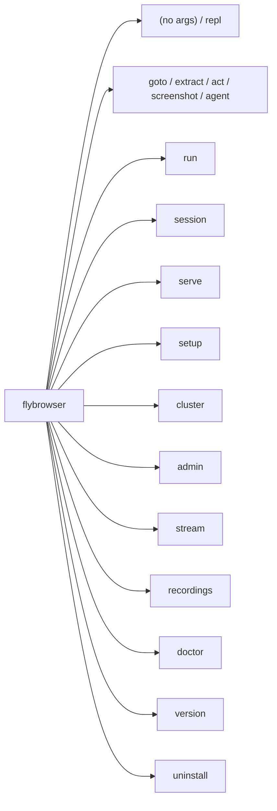

<!--
Copyright 2026 Firefly Software Solutions Inc

Licensed under the Apache License, Version 2.0 (the "License");
you may not use this file except in compliance with the License.
You may obtain a copy of the License at

    http://www.apache.org/licenses/LICENSE-2.0

Unless required by applicable law or agreed to in writing, software
distributed under the License is distributed on an "AS IS" BASIS,
WITHOUT WARRANTIES OR CONDITIONS OF ANY KIND, either express or implied.
See the License for the specific language governing permissions and
limitations under the License.
-->

# CLI Reference

> **Version 26.02.05** | Python 3.13+ | Apache 2.0

FlyBrowser provides a unified command-line interface for interactive browser automation, one-shot commands, workflow execution, server management, and administration.

---

## Command Map



---

## Quick Reference

```bash
# Interactive mode
flybrowser                              # Launch REPL (default)
flybrowser repl                         # Launch REPL (explicit)

# One-shot commands
flybrowser goto https://example.com     # Navigate to URL
flybrowser extract "Get the title"      # Extract data
flybrowser act "Click login"            # Perform action
flybrowser screenshot --output s.png    # Take screenshot
flybrowser agent "Find flights"         # Run agent task

# Workflows
flybrowser run workflow.yaml            # Run YAML workflow
flybrowser run --inline "goto ... && extract ..."  # Inline workflow

# Session management
flybrowser session create               # Create a session
flybrowser session list                 # List sessions

# Server and infrastructure
flybrowser serve                        # Start API server
flybrowser setup                        # Setup wizard
flybrowser cluster status               # Cluster status
flybrowser admin sessions list          # Admin commands
flybrowser stream start <id>            # Start stream
flybrowser recordings list              # List recordings

# Diagnostics
flybrowser doctor                       # Run diagnostics
flybrowser version                      # Show version
flybrowser uninstall                    # Uninstall
```

---

## Global Options

These options are available for all commands:

| Option | Description | Default |
|--------|-------------|---------|
| `--log-level` | Logging level: `DEBUG`, `INFO`, `WARNING`, `ERROR`, `CRITICAL` | `INFO` |
| `--human-readable` / `--human` | Use human-readable log format instead of JSON | `false` (JSON) |
| `--help` | Show help message | -- |

```bash
flybrowser --log-level DEBUG repl
flybrowser --human-readable serve
```

---

## Commands

### `flybrowser` (default)

When run without arguments in an interactive terminal, launches the REPL. When stdin is not a TTY, prints help.

```bash
flybrowser
```

---

### `flybrowser repl`

Launch the interactive Read-Eval-Print Loop for browser automation.

```bash
flybrowser repl [OPTIONS]
```

**Options:**

| Option | Short | Default | Description |
|--------|-------|---------|-------------|
| `--provider` | `-p` | `openai` | LLM provider (`openai`, `anthropic`, `ollama`, `gemini`) |
| `--model` | `-m` | Provider default | LLM model name |
| `--headless` | -- | `true` | Run browser in headless mode |
| `--no-headless` | -- | -- | Run browser with visible UI |
| `--api-key` | -- | `$PROVIDER_API_KEY` | LLM API key (falls back to env var) |
| `--verbosity` | `-v` | `normal` | Log verbosity: `silent`, `minimal`, `normal`, `verbose`, `debug` |

**Examples:**

```bash
# Default (OpenAI, headless)
flybrowser repl

# Use Anthropic Claude with visible browser
flybrowser repl -p anthropic -m claude-sonnet-4-5-20250929 --no-headless

# Local Ollama
flybrowser repl -p ollama -m qwen3:8b

# Debug mode
flybrowser repl -v debug
```

---

### `flybrowser goto`

Navigate to a URL. Auto-creates an ephemeral session if `--session` is not provided.

```bash
flybrowser goto <url> [OPTIONS]
```

| Option | Short | Default | Description |
|--------|-------|---------|-------------|
| `--session` | -- | `null` (ephemeral) | Existing session ID to reuse |
| `--wait-for` | -- | `null` | CSS selector to wait for after navigation |
| `--endpoint` | `-e` | `http://localhost:8000` | FlyBrowser server endpoint |

```bash
flybrowser goto https://example.com
flybrowser goto https://example.com --session sess_abc123 --wait-for "#content"
```

---

### `flybrowser extract`

Extract data from the current page using natural language.

```bash
flybrowser extract <query> [OPTIONS]
```

| Option | Short | Default | Description |
|--------|-------|---------|-------------|
| `--session` | -- | `null` (ephemeral) | Existing session ID to reuse |
| `--schema` | -- | `null` | Path to a JSON schema file for structured extraction |
| `--format` | `-f` | `json` | Output format: `json`, `csv`, `table` |
| `--endpoint` | `-e` | `http://localhost:8000` | FlyBrowser server endpoint |

```bash
flybrowser extract "Get all product names and prices"
flybrowser extract "Get the title" --format table
flybrowser extract "Get contacts" --schema schema.json --session sess_abc123
```

---

### `flybrowser act`

Perform a browser action described in natural language.

```bash
flybrowser act <instruction> [OPTIONS]
```

| Option | Short | Default | Description |
|--------|-------|---------|-------------|
| `--session` | -- | `null` (ephemeral) | Existing session ID to reuse |
| `--endpoint` | `-e` | `http://localhost:8000` | FlyBrowser server endpoint |

```bash
flybrowser act "click the login button"
flybrowser act "type hello@example.com into the email field" --session sess_abc123
```

---

### `flybrowser screenshot`

Capture a screenshot of the current page.

```bash
flybrowser screenshot [OPTIONS]
```

| Option | Short | Default | Description |
|--------|-------|---------|-------------|
| `--session` | -- | `null` (ephemeral) | Existing session ID to reuse |
| `--output` | `-o` | `screenshot.png` | Output file path |
| `--full-page` | -- | `false` | Capture the full scrollable page |
| `--endpoint` | `-e` | `http://localhost:8000` | FlyBrowser server endpoint |

```bash
flybrowser screenshot --output page.png --full-page
flybrowser screenshot --session sess_abc123
```

---

### `flybrowser agent`

Run an autonomous agent task. The agent handles multi-step navigation, extraction, and interaction automatically.

```bash
flybrowser agent <task> [OPTIONS]
```

| Option | Short | Default | Description |
|--------|-------|---------|-------------|
| `--session` | -- | `null` (ephemeral) | Existing session ID to reuse |
| `--max-iterations` | -- | `50` | Maximum number of agent iterations |
| `--stream` | -- | `false` | Stream agent progress to stdout |
| `--endpoint` | `-e` | `http://localhost:8000` | FlyBrowser server endpoint |

```bash
flybrowser agent "Search for flights to Tokyo and find the cheapest option"
flybrowser agent "Fill out the contact form" --max-iterations 30 --stream
```

---

### `flybrowser run`

Run a multi-step browser workflow from a YAML file or inline commands.

```bash
flybrowser run [<workflow.yaml>] [OPTIONS]
```

| Option | Short | Description |
|--------|-------|-------------|
| `workflow` | -- | Path to a YAML workflow file (positional, optional) |
| `--inline` | `-i` | Inline commands separated by `&&` |

**YAML workflow format:**

```yaml
name: my-workflow
sessions:
  main:
    provider: openai
    model: gpt-4o
    headless: true
steps:
  - name: navigate
    session: main
    action: goto
    url: https://example.com
  - name: extract
    session: main
    action: extract
    query: "Get all prices"
```

**Examples:**

```bash
# Run from YAML file
flybrowser run workflow.yaml

# Run inline pipeline
flybrowser run --inline "goto https://example.com && extract 'get the title'"
```

---

### `flybrowser session`

Manage browser sessions (create, list, inspect, execute commands, close).

```bash
flybrowser session <command> [OPTIONS]
```

**Subcommands:**

| Command | Description |
|---------|-------------|
| `create` | Create a new browser session |
| `list` | List active sessions |
| `info <session_id>` | Get session details |
| `connect <session_id>` | Show connection info for a session |
| `exec <session_id> <command>` | Run a command on a session |
| `close <session_id>` | Close a session |
| `close-all` | Close all sessions |

**`session create` options:**

| Option | Short | Default | Description |
|--------|-------|---------|-------------|
| `--provider` | `-p` | `openai` | LLM provider |
| `--model` | `-m` | Provider default | LLM model |
| `--headless` | -- | `true` | Headless mode |
| `--no-headless` | -- | -- | Visible browser |
| `--name` | `-n` | `null` | Optional session name |
| `--api-key` | -- | `null` | LLM API key |
| `--endpoint` | `-e` | `null` (embedded mode) | Server endpoint |

**`session list` options:**

| Option | Short | Default | Description |
|--------|-------|---------|-------------|
| `--format` | `-f` | `table` | Output format: `table`, `json` |
| `--status` | `-s` | `active` | Filter: `active`, `all` |
| `--endpoint` | `-e` | `http://localhost:8000` | Server endpoint |

**`session close-all` options:**

| Option | Description |
|--------|-------------|
| `--force` | Skip confirmation prompt |

**Examples:**

```bash
# Create a session (embedded mode -- no server needed)
flybrowser session create --provider openai --model gpt-4o

# Create a session on a running server
flybrowser session create --endpoint http://localhost:8000

# List sessions
flybrowser session list --format table

# Run a command on a session
flybrowser session exec sess_abc123 "extract the page title"

# Close all sessions
flybrowser session close-all --force
```

---

### `flybrowser serve`

Start the FlyBrowser REST API server.

```bash
flybrowser serve [OPTIONS]
```

**Options:**

| Option | Default | Description |
|--------|---------|-------------|
| `--host` | `0.0.0.0` | Host to bind to |
| `--port` | `8000` | Port to bind to |
| `--workers` | `1` | Number of worker processes |
| `--reload` | `false` | Auto-reload on code changes (development) |
| `--log-level` | `info` | Logging level |
| `--cluster` | `false` | Enable cluster mode (HA) |
| `--node-id` | Auto-generated | Unique node identifier |
| `--peers` | -- | Comma-separated peer addresses (host:raft_port) |
| `--raft-port` | `4321` | Raft consensus port |
| `--data-dir` | `./data` | Data directory for persistent storage |
| `--max-sessions` | `10` | Maximum concurrent sessions |

**Examples:**

```bash
# Default standalone server
flybrowser serve

# Custom port with auto-reload
flybrowser serve --port 9000 --reload

# Production with multiple workers
flybrowser serve --workers 4

# Cluster mode
flybrowser serve --cluster --node-id node1 --peers node2:4321,node3:4321
```

---

### `flybrowser setup`

Installation and configuration wizard with targeted subcommands.

```bash
flybrowser setup [COMMAND]
```

**Subcommands:**

| Command | Description |
|---------|-------------|
| (none) | Full interactive setup wizard |
| `quick` | 30-second quick start (auto-detect LLM, install browser, verify) |
| `install` | Install FlyBrowser and dependencies |
| `configure` | Interactive configuration wizard |
| `browsers` | Install/manage Playwright browsers (`install`, `list`) |
| `verify` | Verify FlyBrowser installation |
| `jupyter` | Manage Jupyter kernel (`install`, `uninstall`, `status`, `fix`) |

> **Note:** LLM, server, observability, and security configuration are accessible through the interactive wizard (`flybrowser setup` with no subcommand) or through `flybrowser setup configure`.

**`setup install` options:**

| Option | Default | Description |
|--------|---------|-------------|
| `--no-browsers` | `false` | Skip Playwright browser installation |
| `--browsers` | `chromium` | Comma-separated list of browsers to install |
| `--configure` | `false` | Run configuration wizard after installation |
| `--interactive` | `true` | Run interactive prompts |
| `--no-wizard` | `false` | Skip interactive prompts, use defaults |

**Examples:**

```bash
# Full interactive wizard
flybrowser setup

# 30-second quick start
flybrowser setup quick

# Install dependencies
flybrowser setup install

# Install with Firefox too
flybrowser setup install --browsers chromium,firefox

# Interactive configuration
flybrowser setup configure

# Verify everything works
flybrowser setup verify

# Install Playwright browsers
flybrowser setup browsers install

# Manage Jupyter kernel
flybrowser setup jupyter install
flybrowser setup jupyter status
```

---

### `flybrowser cluster`

Cluster management commands.

```bash
flybrowser cluster <command> [OPTIONS]
```

**Subcommands:**

| Command | Description |
|---------|-------------|
| `status` | Show cluster status |
| `nodes` | List cluster nodes |
| `sessions` | List cluster sessions |
| `health` | Check cluster health |
| `step-down` | Request leader to step down |
| `rebalance` | Trigger session rebalancing |

All subcommands accept `--endpoint` (default: `http://localhost:8000`) and `--format` (`table` or `json`).

**Examples:**

```bash
# Check cluster status
flybrowser cluster status

# List all nodes
flybrowser cluster nodes

# Trigger rebalancing
flybrowser cluster rebalance
```

---

### `flybrowser admin`

Administrative commands for managing sessions, nodes, and backups.

```bash
flybrowser admin <command> [OPTIONS]
```

**Subcommands:**

| Command | Subcommand | Description |
|---------|------------|-------------|
| `sessions` | `list` | List active sessions |
| `sessions` | `kill <session_id>` | Kill a session |
| `nodes` | `list` | List cluster nodes |
| `nodes` | `drain <node_id>` | Drain sessions from a node |
| `backup` | -- | Backup cluster state |
| `restore` | -- | Restore cluster state |

All subcommands accept `--endpoint` (default: `http://localhost:8000`).

**Examples:**

```bash
# List all sessions
flybrowser admin sessions list

# Kill a session
flybrowser admin sessions kill sess_abc123

# Backup cluster state
flybrowser admin backup --output backup.json

# Restore from backup
flybrowser admin restore --input backup.json
```

---

### `flybrowser stream`

Manage live streams of browser sessions.

```bash
flybrowser stream <command> [OPTIONS]
```

**Subcommands:**

| Command | Description |
|---------|-------------|
| `start <session_id>` | Start a stream |
| `stop <session_id>` | Stop a stream |
| `status <session_id>` | Get stream status |
| `url <session_id>` | Get stream playback URL |
| `play <session_id>` | Play stream in local player |
| `web <session_id>` | Open stream in web browser |

**`stream start` options:**

| Option | Default | Choices | Description |
|--------|---------|---------|-------------|
| `--protocol` | `hls` | `hls`, `dash`, `rtmp` | Streaming protocol |
| `--quality` | `medium` | `low_bandwidth`, `medium`, `high` | Quality profile |
| `--codec` | `h264` | `h264`, `h265`, `vp9` | Video codec |
| `--endpoint` | `http://localhost:8000` | -- | API endpoint |

**`stream play` options:**

| Option | Default | Choices | Description |
|--------|---------|---------|-------------|
| `--player` | `auto` | `auto`, `ffplay`, `vlc`, `mpv` | Player to use |
| `--endpoint` | `http://localhost:8000` | -- | API endpoint |

**Examples:**

```bash
# Start HLS stream
flybrowser stream start sess_abc123 --protocol hls --quality high

# Stop stream
flybrowser stream stop sess_abc123

# Get status
flybrowser stream status sess_abc123

# Open embedded player in browser
flybrowser stream web sess_abc123

# Play with VLC
flybrowser stream play sess_abc123 --player vlc
```

---

### `flybrowser recordings`

Manage session recordings.

```bash
flybrowser recordings <command> [OPTIONS]
```

**Subcommands:**

| Command | Description |
|---------|-------------|
| `list` | List recordings |
| `download <recording_id>` | Download a recording |
| `delete <recording_id>` | Delete a recording |
| `clean` | Clean old recordings |

**Options by subcommand:**

| Subcommand | Option | Default | Description |
|------------|--------|---------|-------------|
| `list` | `--session-id` | `null` | Filter by session ID |
| `download` | `--output`, `-o` | `recording.mp4` | Output file path |
| `clean` | `--older-than` | `7d` | Delete recordings older than (e.g., `7d`, `30d`) |
| All | `--endpoint` | `http://localhost:8000` | API endpoint |

**Examples:**

```bash
# List all recordings
flybrowser recordings list

# List recordings for a session
flybrowser recordings list --session-id sess_abc123

# Download a recording
flybrowser recordings download rec_123 -o my_recording.mp4

# Delete a recording
flybrowser recordings delete rec_123

# Clean recordings older than 30 days
flybrowser recordings clean --older-than 30d
```

---

### `flybrowser doctor`

Run installation diagnostics to verify FlyBrowser is properly set up.

```bash
flybrowser doctor
```

**Checks performed:**

1. Python version (requires 3.13+)
2. FlyBrowser package installation
3. Playwright installation
4. Browser availability (Chromium)
5. LLM provider status (via `fireflyframework-genai` SDK)
6. Configuration files (`.env`, `~/.flybrowser/config`, `~/.config/flybrowser/config`)

**Example output:**

```
+---------------------------------------------------------------+
|  FlyBrowser v26.02.05                                         |
+---------------------------------------------------------------+

System Requirements
----------------------------------------------------------------
[OK]   Python 3.13.2
[OK]   FlyBrowser 26.02.05 installed
[OK]   Playwright installed
[OK]   Chromium browser available

LLM Provider Status
----------------------------------------------------------------
[INFO] LLM provider discovery now handled by fireflyframework-genai SDK

Configuration
----------------------------------------------------------------
[OK]   Config found: /home/user/.flybrowser/config

Summary
================================================================
[SUCCESS] All checks passed!

You're ready to use FlyBrowser. Try:
  flybrowser repl         # Interactive mode
  flybrowser serve        # Start service
```

---

### `flybrowser version`

Show version information.

```bash
flybrowser version [OPTIONS]
```

| Option | Short | Description |
|--------|-------|-------------|
| `--json` | `-j` | Output in JSON format |

**Examples:**

```bash
flybrowser version
# FlyBrowser 26.02.05

flybrowser version --json
# {
#   "flybrowser": "26.02.05",
#   "python": "3.13.2",
#   "platform": "Darwin",
#   "architecture": "arm64"
# }
```

---

### `flybrowser uninstall`

Uninstall FlyBrowser and optionally remove all data.

```bash
flybrowser uninstall [OPTIONS]
```

| Option | Short | Default | Description |
|--------|-------|---------|-------------|
| `--all` | -- | `false` | Remove everything including data and configuration |
| `--keep-data` | -- | `false` | Keep configuration and data (remove only binaries) |
| `--force` | `-f` | `false` | Skip confirmation prompt |
| `--install-dir` | -- | `/usr/local/bin` | CLI installation directory |
| `--venv-dir` | -- | `~/.flybrowser/venv` | Virtual environment directory |

```bash
flybrowser uninstall
flybrowser uninstall --all --force
flybrowser uninstall --keep-data
```

---

## Interactive REPL Commands

When using `flybrowser` or `flybrowser repl`, these commands are available at the REPL prompt:

| Command | Description |
|---------|-------------|
| `goto <url>` | Navigate to a URL |
| `extract <query>` | Extract data using natural language |
| `act <action>` | Perform an action (click, type, etc.) |
| `screenshot [filename]` | Take a screenshot |
| `html` | Show current page HTML |
| `url` | Show current URL |
| `title` | Show current page title |
| `wait <condition>` | Wait for a condition |
| `session` | Show session info |
| `reset` | Reset the browser session |
| `config` | Show/edit configuration |
| `help [command]` | Show help |
| `exit` / `quit` | Exit the REPL |

**Features:**

- Tab completion for commands
- Persistent command history (`~/.flybrowser/history`)
- Session persistence (browser stays open between commands)
- Natural language input for browser automation

---

## Environment Variables

The CLI respects these environment variables:

| Variable | Description | Used By |
|----------|-------------|---------|
| `FLYBROWSER_LOG_LEVEL` | Default log level | All commands |
| `FLYBROWSER_LOG_FORMAT` | Log format: `json` or `human` | All commands |
| `FLYBROWSER_LLM_PROVIDER` | Default LLM provider | `repl`, `session create` |
| `FLYBROWSER_LLM_MODEL` | Default LLM model | `repl`, `session create` |
| `FLYBROWSER_LOG_VERBOSITY` | Default REPL verbosity | `repl` |
| `FLYBROWSER_ENDPOINT` | Default server endpoint | Direct commands, `session` |
| `FLYBROWSER_HOST` | Server bind host | `serve` |
| `FLYBROWSER_PORT` | Server bind port | `serve` |
| `FLYBROWSER_WORKERS` | Server worker count | `serve` |
| `FLYBROWSER_MAX_SESSIONS` | Max concurrent sessions | `serve` |
| `FLYBROWSER_CLUSTER_ENABLED` | Enable cluster mode | `serve` |
| `FLYBROWSER_NODE_ID` | Cluster node identifier | `serve` |
| `FLYBROWSER_CLUSTER_PEERS` | Cluster peer addresses | `serve` |
| `FLYBROWSER_RAFT_PORT` | Raft consensus port | `serve` |
| `FLYBROWSER_DATA_DIR` | Persistent storage directory | `serve` |
| `OPENAI_API_KEY` | OpenAI API key | `repl`, `session create` |
| `ANTHROPIC_API_KEY` | Anthropic API key | `repl`, `session create` |
| `GOOGLE_API_KEY` | Google Gemini API key | `repl`, `session create` |

---

## Configuration Files

The CLI looks for configuration in these locations (in order):

1. `.env` in the current working directory
2. `~/.flybrowser/config`
3. `~/.config/flybrowser/config`

Run `flybrowser setup configure` to create a configuration file interactively.

---

## Exit Codes

| Code | Description |
|------|-------------|
| `0` | Success |
| `1` | General error or check failed |
| `130` | Interrupted by user (`Ctrl+C`) |

---

## See Also

- [REST API Reference](rest-api.md) -- HTTP API documentation
- [SDK Reference](sdk.md) -- Python SDK documentation
- [Configuration](configuration.md) -- Service configuration options
- [Setup Wizard](../getting-started/setup-wizard.md) -- Setup subcommand walkthroughs
