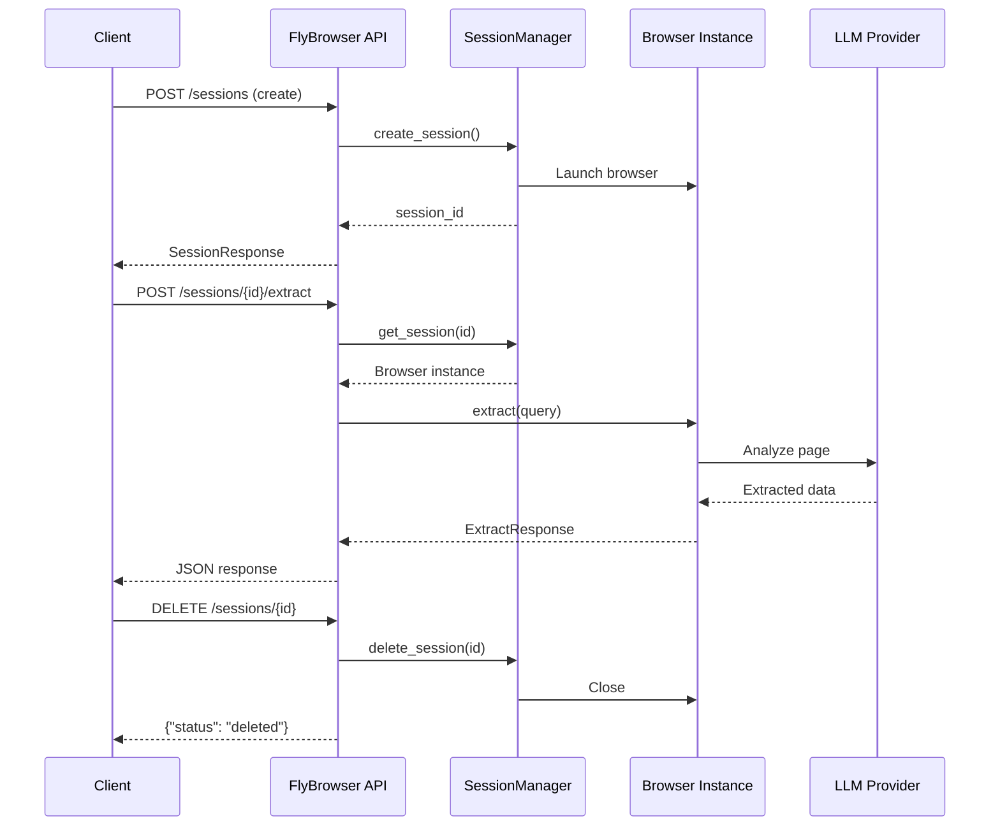

<!--
Copyright 2026 Firefly Software Solutions Inc

Licensed under the Apache License, Version 2.0 (the "License");
you may not use this file except in compliance with the License.
You may obtain a copy of the License at

    http://www.apache.org/licenses/LICENSE-2.0

Unless required by applicable law or agreed to in writing, software
distributed under the License is distributed on an "AS IS" BASIS,
WITHOUT WARRANTIES OR CONDITIONS OF ANY KIND, either express or implied.
See the License for the specific language governing permissions and
limitations under the License.
-->

# REST API Reference

> **Version 26.02.06** | Python 3.13+ | Apache 2.0

FlyBrowser exposes a comprehensive REST API built on [FastAPI](https://fastapi.tiangolo.com/) via the `fireflyframework-genai` application factory. The API supports session-based browser automation, AI-powered data extraction, live streaming, recording, and cluster orchestration.

---

## Base URL

```
http://localhost:8000
```

## Interactive Documentation

FastAPI provides auto-generated interactive docs:

| Interface | URL |
|-----------|-----|
| Swagger UI | `http://localhost:8000/docs` |
| ReDoc | `http://localhost:8000/redoc` |
| OpenAPI Spec | `http://localhost:8000/openapi.json` |

---

## Authentication

FlyBrowser supports two authentication methods. Both are optional in development but recommended for production.

### Method 1: API Key

Pass a key in the `X-API-Key` header. Development keys are auto-generated on startup with the prefix `flybrowser_dev_`.

```bash
curl -H "X-API-Key: flybrowser_dev_..." http://localhost:8000/sessions
```

### Method 2: JWT Bearer Token

Pass a signed JWT in the `Authorization` header. Tokens are created via `RBACAuthManager.create_token()` and carry role claims.

```bash
curl -H "Authorization: Bearer eyJhbG..." http://localhost:8000/sessions
```

### RBAC Roles

| Role | Permissions |
|------|-------------|
| `admin` | `*` (all operations) |
| `operator` | `sessions.create`, `sessions.delete`, `sessions.list`, `sessions.get`, `sessions.navigate`, `sessions.extract`, `sessions.act`, `sessions.agent`, `sessions.screenshot`, `sessions.observe`, `sessions.stream`, `recordings.list`, `recordings.download` |
| `viewer` | `sessions.list`, `sessions.get`, `recordings.list`, `recordings.download` |

---

## Request Flow



---

## Endpoint Reference

### Framework-Provided Endpoints

These endpoints are injected by `create_genai_app()` from `fireflyframework-genai`:

| Method | Path | Description |
|--------|------|-------------|
| `GET` | `/health/live` | Kubernetes liveness probe |
| `GET` | `/health/ready` | Kubernetes readiness probe |
| `GET` | `/agents` | List registered GenAI agents |

> **Note:** The framework's generic `/health` route is replaced by FlyBrowser's richer health endpoint (see below).

---

### Health and Metrics

#### `GET /health`

Returns service health status. **No authentication required.**

**Response model:** `HealthResponse`

| Field | Type | Description |
|-------|------|-------------|
| `status` | string | Service status (e.g., `"healthy"`) |
| `version` | string | FlyBrowser version (`"26.02.06"`) |
| `uptime_seconds` | float | Seconds since service start |
| `active_sessions` | int | Current number of active sessions |
| `system_info` | object | System information (e.g., `{"sessions": 5}`) |

```bash
curl http://localhost:8000/health
```

```json
{
  "status": "healthy",
  "version": "26.02.06",
  "uptime_seconds": 3600.5,
  "active_sessions": 5,
  "system_info": {
    "sessions": 5
  }
}
```

---

#### `GET /metrics`

Returns detailed service metrics.

**Response model:** `MetricsResponse`

| Field | Type | Description |
|-------|------|-------------|
| `total_requests` | int | Total requests processed |
| `active_sessions` | int | Currently active sessions |
| `cache_stats` | object | Cache hit/miss statistics |
| `cost_stats` | object | LLM cost tracking data |
| `rate_limit_stats` | object | Rate limit counters |

```bash
curl http://localhost:8000/metrics
```

```json
{
  "total_requests": 1250,
  "active_sessions": 5,
  "cache_stats": {},
  "cost_stats": {},
  "rate_limit_stats": {}
}
```

---

### Session Management

#### `POST /sessions`

Create a new browser session.

**Request model:** `SessionCreateRequest`

| Field | Type | Required | Default | Description |
|-------|------|----------|---------|-------------|
| `llm_provider` | string | **Yes** | -- | LLM provider (`openai`, `anthropic`, `ollama`, `gemini`) |
| `llm_model` | string | No | Provider default | Model name (e.g., `gpt-4o`, `claude-sonnet-4-5-20250929`) |
| `api_key` | string | Depends | -- | API key for the LLM provider |
| `headless` | boolean | No | `true` | Run browser without visible UI |
| `browser_type` | string | No | `chromium` | Browser engine: `chromium`, `firefox`, `webkit` |
| `timeout` | int | No | `60` | Default operation timeout in seconds (10--300) |

**Response model:** `SessionResponse`

| Field | Type | Description |
|-------|------|-------------|
| `session_id` | string | Unique session identifier |
| `status` | string | Session status (`"active"`) |
| `created_at` | string | ISO 8601 creation timestamp |
| `metadata` | object | Additional metadata (e.g., `{"browser_type": "chromium"}`) |

```bash
curl -X POST http://localhost:8000/sessions \
  -H "Content-Type: application/json" \
  -d '{
    "llm_provider": "openai",
    "llm_model": "gpt-4o",
    "api_key": "sk-...",
    "headless": true,
    "browser_type": "chromium"
  }'
```

```json
{
  "session_id": "abc123",
  "status": "active",
  "created_at": "2026-02-13T10:30:00Z",
  "metadata": {
    "browser_type": "chromium"
  }
}
```

---

#### `GET /sessions`

List all active browser sessions.

```bash
curl http://localhost:8000/sessions
```

```json
{
  "sessions": [
    {
      "session_id": "abc123",
      "status": "active",
      "created_at": "2026-02-13T10:30:00Z",
      "last_activity": "2026-02-13T10:35:00Z",
      "llm_provider": "openai",
      "browser_type": "chromium"
    }
  ],
  "total": 1
}
```

---

#### `GET /sessions/{session_id}`

Get detailed information about a specific session.

```bash
curl http://localhost:8000/sessions/abc123
```

```json
{
  "session_id": "abc123",
  "status": "active",
  "created_at": "2026-02-13T10:30:00Z",
  "last_activity": "2026-02-13T10:35:00Z",
  "llm_provider": "openai",
  "llm_model": "gpt-4o",
  "browser_type": "chromium"
}
```

---

#### `DELETE /sessions/{session_id}`

Close and delete a browser session, releasing all associated resources.

```bash
curl -X DELETE http://localhost:8000/sessions/abc123
```

```json
{
  "status": "deleted",
  "session_id": "abc123"
}
```

---

### Navigation

#### `POST /sessions/{session_id}/navigate`

Navigate the browser to a specific URL.

**Request model:** `NavigateRequest`

| Field | Type | Required | Default | Description |
|-------|------|----------|---------|-------------|
| `url` | string (HttpUrl) | **Yes** | -- | URL to navigate to |
| `wait_until` | string | No | `domcontentloaded` | Load state: `load`, `domcontentloaded`, `networkidle` |
| `timeout` | int | No | `null` | Navigation timeout in milliseconds |

**Response model:** `NavigateResponse`

| Field | Type | Description |
|-------|------|-------------|
| `success` | boolean | Whether navigation succeeded |
| `url` | string | Final URL after navigation (may differ due to redirects) |
| `title` | string | Page title |
| `duration_ms` | int | Navigation duration in milliseconds |

```bash
curl -X POST http://localhost:8000/sessions/abc123/navigate \
  -H "Content-Type: application/json" \
  -d '{"url": "https://example.com", "wait_until": "networkidle"}'
```

```json
{
  "success": true,
  "url": "https://example.com",
  "title": "Example Domain",
  "duration_ms": 1250
}
```

---

#### `POST /sessions/{session_id}/navigate-nl`

Navigate using natural language instructions (e.g., "go to the login page").

**Request model:** `NavigateNLRequest`

| Field | Type | Required | Default | Description |
|-------|------|----------|---------|-------------|
| `instruction` | string | **Yes** | -- | Natural language navigation instruction |
| `use_vision` | boolean | No | `true` | Use vision for element detection |
| `context` | object | No | `{}` | Additional context (conditions, preferences) |

**Response model:** `NavigateNLResponse`

| Field | Type | Description |
|-------|------|-------------|
| `success` | boolean | Whether navigation succeeded |
| `url` | string | Final URL after navigation |
| `title` | string | Page title |
| `navigation_type` | string | Type of navigation performed |
| `error` | string | Error message if failed |

```bash
curl -X POST http://localhost:8000/sessions/abc123/navigate-nl \
  -H "Content-Type: application/json" \
  -d '{"instruction": "go to the login page", "use_vision": true}'
```

```json
{
  "success": true,
  "url": "https://example.com/login",
  "title": "Login",
  "navigation_type": "react",
  "error": null
}
```

---

### Automation

#### `POST /sessions/{session_id}/extract`

Extract data from the current page using a natural language query.

**Request model:** `ExtractRequest`

| Field | Type | Required | Default | Description |
|-------|------|----------|---------|-------------|
| `query` | string | **Yes** | -- | Natural language extraction query |
| `use_vision` | boolean | No | `false` | Use vision-based extraction |
| `schema` | object | No | `null` | JSON Schema for structured output |
| `context` | object | No | `{}` | Additional context (filters, preferences, constraints) |

**Response model:** `ExtractResponse`

| Field | Type | Description |
|-------|------|-------------|
| `success` | boolean | Whether extraction succeeded |
| `data` | object | Extracted data |
| `confidence` | float | Confidence score (optional) |
| `cached` | boolean | Whether the result was served from cache |
| `metadata` | object | Additional metadata |
| `llm_usage` | `LLMUsageResponse` | Token counts, cost, model info |
| `page_metrics` | `PageMetricsResponse` | Page size, element count, obstacles |
| `timing` | `TimingResponse` | Timing breakdown by phase |

<details>
<summary><strong>LLMUsageResponse fields</strong></summary>

| Field | Type | Description |
|-------|------|-------------|
| `prompt_tokens` | int | Input tokens consumed |
| `completion_tokens` | int | Output tokens generated |
| `total_tokens` | int | Total tokens used |
| `cost_usd` | float | Estimated cost in USD |
| `model` | string | Model used for inference |
| `calls_count` | int | Number of LLM API calls |
| `cached_calls` | int | Number of cached responses |

</details>

<details>
<summary><strong>PageMetricsResponse fields</strong></summary>

| Field | Type | Description |
|-------|------|-------------|
| `url` | string | Page URL |
| `title` | string | Page title |
| `html_size_bytes` | int | HTML content size in bytes |
| `html_size_kb` | float | HTML content size in KB |
| `element_count` | int | Total element count |
| `interactive_element_count` | int | Interactive element count |
| `obstacles_detected` | int | Obstacles detected (e.g., cookie banners) |
| `obstacles_dismissed` | int | Obstacles automatically dismissed |

</details>

<details>
<summary><strong>TimingResponse fields</strong></summary>

| Field | Type | Description |
|-------|------|-------------|
| `total_ms` | float | Total duration in milliseconds |
| `phases` | object | Timing breakdown by phase |
| `started_at` | string | Start timestamp |
| `ended_at` | string | End timestamp |

</details>

```bash
curl -X POST http://localhost:8000/sessions/abc123/extract \
  -H "Content-Type: application/json" \
  -d '{
    "query": "Get all product names and prices",
    "use_vision": false,
    "schema": {
      "type": "array",
      "items": {
        "type": "object",
        "properties": {
          "name": {"type": "string"},
          "price": {"type": "string"}
        }
      }
    }
  }'
```

```json
{
  "success": true,
  "data": [
    {"name": "Product A", "price": "$19.99"},
    {"name": "Product B", "price": "$29.99"}
  ],
  "confidence": null,
  "cached": false,
  "metadata": {},
  "llm_usage": {
    "prompt_tokens": 1500,
    "completion_tokens": 200,
    "total_tokens": 1700,
    "cost_usd": 0.0034,
    "model": "gpt-4o",
    "calls_count": 1,
    "cached_calls": 0
  },
  "page_metrics": {
    "url": "https://shop.example.com/products",
    "title": "Products",
    "html_size_bytes": 45000,
    "html_size_kb": 43.95,
    "element_count": 150,
    "interactive_element_count": 25,
    "obstacles_detected": 1,
    "obstacles_dismissed": 1
  },
  "timing": {
    "total_ms": 2500.0,
    "phases": {},
    "started_at": "2026-02-13T10:30:00Z",
    "ended_at": "2026-02-13T10:30:02Z"
  }
}
```

---

#### `POST /sessions/{session_id}/act`

Perform an action on the current page using natural language.

**Request model:** `ActionRequest`

| Field | Type | Required | Default | Description |
|-------|------|----------|---------|-------------|
| `instruction` | string | **Yes** | -- | Natural language action instruction |
| `use_vision` | boolean | No | `true` | Use vision for element detection |
| `context` | object | No | `{}` | Context (form_data, files, constraints) |
| `wait_after` | int | No | `1000` | Wait time after action in ms (0--unbounded) |

**Response model:** `ActionResponse`

| Field | Type | Description |
|-------|------|-------------|
| `success` | boolean | Whether the action succeeded |
| `action_type` | string | Type of action performed (`"act"`) |
| `element_found` | boolean | Whether target element was found |
| `duration_ms` | int | Action duration in milliseconds |
| `metadata` | object | Additional metadata |
| `llm_usage` | `LLMUsageResponse` | LLM usage statistics |
| `page_metrics` | `PageMetricsResponse` | Page metrics |
| `timing` | `TimingResponse` | Timing breakdown |

**Context fields for form filling and file upload:**

```json
{
  "context": {
    "form_data": {
      "input[name=email]": "user@example.com",
      "input[name=password]": "secret123"
    },
    "files": [
      {
        "field": "resume",
        "path": "/path/to/resume.pdf",
        "mime_type": "application/pdf"
      }
    ]
  }
}
```

```bash
curl -X POST http://localhost:8000/sessions/abc123/act \
  -H "Content-Type: application/json" \
  -d '{"instruction": "click the login button", "use_vision": true}'
```

```json
{
  "success": true,
  "action_type": "act",
  "element_found": true,
  "duration_ms": 850,
  "metadata": {},
  "llm_usage": null,
  "page_metrics": null,
  "timing": null
}
```

---

#### `POST /sessions/{session_id}/agent`

Execute a complex, multi-step task using the intelligent agent. **This is the recommended endpoint for multi-step browser automation.**

**Request model:** `AgentRequest`

| Field | Type | Required | Default | Constraints | Description |
|-------|------|----------|---------|-------------|-------------|
| `task` | string | **Yes** | -- | -- | High-level task in natural language |
| `context` | object | No | `{}` | -- | User-provided context (preferences, constraints, form_data, files) |
| `max_iterations` | int | No | `50` | 1--500 | Maximum action iterations |
| `max_time_seconds` | float | No | `1800.0` | 30--7200 | Maximum execution time in seconds |

**Response model:** `AgentResponse`

| Field | Type | Description |
|-------|------|-------------|
| `success` | boolean | Whether the task completed successfully |
| `task` | string | The original task |
| `result_data` | any | Data produced (extracted information, confirmation, etc.) |
| `iterations` | int | Total iterations executed |
| `duration_seconds` | float | Total execution time in seconds |
| `final_url` | string | Final URL after execution |
| `error_message` | string | Error message if failed |
| `execution_history` | array | Summary of actions taken during execution |
| `llm_usage` | `LLMUsageResponse` | LLM usage statistics (optional) |

```bash
curl -X POST http://localhost:8000/sessions/abc123/agent \
  -H "Content-Type: application/json" \
  -d '{
    "task": "Search for python programming and extract the top 5 results",
    "context": {
      "preferences": {"max_results": 5}
    },
    "max_iterations": 50,
    "max_time_seconds": 600
  }'
```

```json
{
  "success": true,
  "task": "Search for python programming and extract the top 5 results",
  "result_data": ["..."],
  "iterations": 8,
  "duration_seconds": 15.5,
  "final_url": "https://google.com/search?q=python+programming",
  "error_message": null,
  "execution_history": [
    {"step": 1, "action": "navigate", "details": "..."},
    {"step": 2, "action": "type", "details": "..."}
  ],
  "llm_usage": null
}
```

---

#### `POST /sessions/{session_id}/observe`

Analyze the page to find elements matching a natural language description.

**Request model:** `ObserveRequest`

| Field | Type | Required | Default | Description |
|-------|------|----------|---------|-------------|
| `query` | string | **Yes** | -- | Natural language description of what to find |
| `return_selectors` | boolean | No | `true` | Include CSS selectors in response |
| `context` | object | No | `{}` | Additional context (filters, constraints) |

**Response model:** `ObserveResponse`

| Field | Type | Description |
|-------|------|-------------|
| `success` | boolean | Whether observation succeeded |
| `elements` | array | List of found elements with selectors and info |
| `page_url` | string | Current page URL |
| `error` | string | Error message if failed |

```bash
curl -X POST http://localhost:8000/sessions/abc123/observe \
  -H "Content-Type: application/json" \
  -d '{"query": "find the search input", "return_selectors": true}'
```

```json
{
  "success": true,
  "elements": [
    {
      "selector": "#search-input",
      "description": "Search input field",
      "tag": "input",
      "text": "",
      "visible": true,
      "actionable": true
    }
  ],
  "page_url": "https://example.com",
  "error": null
}
```

---

#### `POST /sessions/{session_id}/workflow`

Execute a multi-step workflow with state management.

**Request model:** `WorkflowRequest`

| Field | Type | Required | Default | Description |
|-------|------|----------|---------|-------------|
| `workflow` | object | **Yes** | -- | Workflow definition (steps, conditions, etc.) |
| `variables` | object | No | `{}` | Variables for template interpolation |

**Response model:** `WorkflowResponse`

| Field | Type | Description |
|-------|------|-------------|
| `success` | boolean | Whether workflow completed successfully |
| `steps_completed` | int | Number of steps completed |
| `total_steps` | int | Total number of steps |
| `error` | string | Error message if failed |
| `step_results` | array | Results from each step |
| `variables` | object | Final variable state |

```bash
curl -X POST http://localhost:8000/sessions/abc123/workflow \
  -H "Content-Type: application/json" \
  -d '{
    "workflow": {
      "steps": [
        {"action": "navigate", "url": "https://example.com"},
        {"action": "click", "selector": "#login"},
        {"action": "fill", "selector": "#email", "value": "{{email}}"}
      ]
    },
    "variables": {"email": "user@example.com"}
  }'
```

---

#### `POST /sessions/{session_id}/monitor`

Monitor the page for a natural-language condition to be met.

**Request model:** `MonitorRequest`

| Field | Type | Required | Default | Constraints | Description |
|-------|------|----------|---------|-------------|-------------|
| `condition` | string | **Yes** | -- | -- | Natural language condition to wait for |
| `timeout` | float | No | `30.0` | 1.0--300.0 | Maximum wait time in seconds |
| `poll_interval` | float | No | `0.5` | 0.1--10.0 | Time between checks in seconds |

**Response model:** `MonitorResponse`

| Field | Type | Description |
|-------|------|-------------|
| `success` | boolean | Whether monitoring completed without error |
| `condition_met` | boolean | Whether the condition was met |
| `elapsed_time` | float | Time elapsed in seconds |
| `error` | string | Error message if failed |
| `details` | object | Additional details |

```bash
curl -X POST http://localhost:8000/sessions/abc123/monitor \
  -H "Content-Type: application/json" \
  -d '{
    "condition": "wait for the loading spinner to disappear",
    "timeout": 30.0,
    "poll_interval": 1.0
  }'
```

---

### Screenshots

#### `POST /sessions/{session_id}/screenshot`

Capture a screenshot of the current page.

**Request model:** `ScreenshotRequest`

| Field | Type | Required | Default | Description |
|-------|------|----------|---------|-------------|
| `full_page` | boolean | No | `false` | Capture full scrollable page |
| `format` | string | No | `png` | Image format: `png`, `jpeg`, `webp` |
| `quality` | int | No | `80` | Image quality for JPEG/WebP (1--100) |
| `mask_pii` | boolean | No | `true` | Apply PII masking to the screenshot |

**Response model:** `ScreenshotResponse`

| Field | Type | Description |
|-------|------|-------------|
| `success` | boolean | Whether screenshot was captured |
| `screenshot_id` | string | Unique screenshot identifier |
| `format` | string | Image format |
| `width` | int | Image width in pixels |
| `height` | int | Image height in pixels |
| `data_base64` | string | Base64-encoded image data |
| `url` | string | Page URL when screenshot was taken |
| `timestamp` | float | Capture timestamp |

```bash
curl -X POST http://localhost:8000/sessions/abc123/screenshot \
  -H "Content-Type: application/json" \
  -d '{"full_page": true, "mask_pii": true}'
```

---

### Recording

#### `POST /sessions/{session_id}/recording/start`

Start recording the browser session.

**Request model:** `RecordingStartRequest`

| Field | Type | Required | Default | Description |
|-------|------|----------|---------|-------------|
| `video_enabled` | boolean | No | `true` | Enable video recording |
| `codec` | string | No | `h264` | Video codec: `h264`, `h265`, `vp9` |
| `quality` | string | No | `medium` | Quality: `low_bandwidth`, `medium`, `high`, `lossless` |
| `enable_hw_accel` | boolean | No | `true` | Enable hardware acceleration |
| `enable_streaming` | boolean | No | `false` | Enable streaming output |
| `stream_protocol` | string | No | `null` | Streaming protocol: `hls`, `dash`, `rtmp` |
| `screenshot_interval` | float | No | `null` | Periodic screenshot interval in seconds |
| `auto_screenshot_on_navigation` | boolean | No | `true` | Capture screenshot on each navigation |

**Response model:** `RecordingStartResponse`

| Field | Type | Description |
|-------|------|-------------|
| `success` | boolean | Whether recording started |
| `recording_id` | string | Recording session ID |
| `video_enabled` | boolean | Whether video is being recorded |

```bash
curl -X POST http://localhost:8000/sessions/abc123/recording/start \
  -H "Content-Type: application/json" \
  -d '{"video_enabled": true, "codec": "h264", "quality": "high"}'
```

---

#### `POST /sessions/{session_id}/recording/stop`

Stop recording and return recording metadata.

**Response model:** `RecordingStopResponse`

| Field | Type | Description |
|-------|------|-------------|
| `success` | boolean | Whether recording stopped successfully |
| `recording_id` | string | Recording session ID |
| `duration_seconds` | float | Recording duration |
| `screenshot_count` | int | Number of screenshots captured |
| `video_path` | string | Path to the video file (optional) |
| `video_size_bytes` | int | Video file size (optional) |

```bash
curl -X POST http://localhost:8000/sessions/abc123/recording/stop
```

---

#### `GET /recordings`

List all available recordings.

**Query parameters:**

| Parameter | Type | Default | Description |
|-----------|------|---------|-------------|
| `session_id` | string | `null` | Filter by session ID |
| `limit` | int | `100` | Maximum number of recordings to return |

**Response model:** `RecordingListResponse`

| Field | Type | Description |
|-------|------|-------------|
| `recordings` | array | List of recording objects |
| `total` | int | Total count |

```bash
curl http://localhost:8000/recordings?session_id=abc123&limit=50
```

---

#### `GET /recordings/{recording_id}/download`

Get download information for a recording (presigned URL if S3 storage).

**Response model:** `RecordingDownloadResponse`

| Field | Type | Description |
|-------|------|-------------|
| `recording_id` | string | Recording identifier |
| `file_name` | string | File name |
| `file_size_bytes` | int | File size in bytes |
| `download_url` | string | Download URL (presigned if S3) |
| `expires_at` | float | URL expiration timestamp (optional) |

```bash
curl http://localhost:8000/recordings/rec_abc123/download
```

---

#### `DELETE /recordings/{recording_id}`

Delete a recording from storage.

```bash
curl -X DELETE http://localhost:8000/recordings/rec_abc123
```

```json
{
  "success": true,
  "recording_id": "rec_abc123"
}
```

---

### Streaming

#### `POST /sessions/{session_id}/stream/start`

Start a live stream of the browser session.

> **Note:** Returns `503 Service Unavailable` if streaming is not enabled in the service configuration.

**Request model:** `StreamStartRequest`

| Field | Type | Required | Default | Description |
|-------|------|----------|---------|-------------|
| `protocol` | string | No | `hls` | Streaming protocol: `hls`, `dash`, `rtmp` |
| `quality` | string | No | `high` | Quality: `low_bandwidth`, `medium`, `high`, `ultra_high`, `local_high`, `local_4k`, `studio` |
| `codec` | string | No | `h264` | Video codec: `h264`, `h265`, `vp9` |
| `width` | int | No | `null` | Video width in pixels (e.g., 1920, 3840) |
| `height` | int | No | `null` | Video height in pixels (e.g., 1080, 2160) |
| `frame_rate` | int | No | `null` | Frames per second (default: 30) |
| `rtmp_url` | string | No | `null` | RTMP destination URL |
| `rtmp_key` | string | No | `null` | RTMP stream key |
| `max_viewers` | int | No | `100` | Maximum concurrent viewers |

**Response model:** `StreamStartResponse`

| Field | Type | Description |
|-------|------|-------------|
| `success` | boolean | Whether stream started |
| `stream_id` | string | Stream identifier |
| `hls_url` | string | HLS playlist URL (optional) |
| `dash_url` | string | DASH manifest URL (optional) |
| `rtmp_url` | string | RTMP URL (optional) |
| `websocket_url` | string | WebSocket URL for updates (optional) |
| `player_url` | string | Embedded web player URL (optional) |

```bash
curl -X POST http://localhost:8000/sessions/abc123/stream/start \
  -H "Content-Type: application/json" \
  -d '{"protocol": "hls", "quality": "high", "codec": "h264"}'
```

```json
{
  "success": true,
  "stream_id": "stream_abc123",
  "hls_url": "http://localhost:8000/streams/stream_abc123/playlist.m3u8",
  "dash_url": null,
  "rtmp_url": null,
  "websocket_url": null,
  "player_url": "http://localhost:8000/streams/stream_abc123/player"
}
```

---

#### `GET /sessions/{session_id}/stream/status`

Get current stream status and metrics.

**Response model:** `StreamStatusResponse`

| Field | Type | Description |
|-------|------|-------------|
| `stream_id` | string | Stream identifier |
| `session_id` | string | Browser session ID |
| `state` | string | Stream state: `active`, `paused`, `stopped`, `error` |
| `health` | string | Stream health: `healthy`, `degraded`, `unhealthy` |
| `protocol` | string | Streaming protocol |
| `started_at` | float | Start timestamp |
| `uptime_seconds` | float | Stream uptime |
| `viewer_count` | int | Current viewer count |
| `metrics` | object | Detailed stream metrics |
| `urls` | object | Stream URLs (`hls`, `dash`, `rtmp`, `websocket`, `player`) |

```bash
curl http://localhost:8000/sessions/abc123/stream/status
```

---

#### `POST /sessions/{session_id}/stream/stop`

Stop the active stream for this session.

**Response model:** `StreamStopResponse`

| Field | Type | Description |
|-------|------|-------------|
| `success` | boolean | Whether stream stopped |
| `stream_id` | string | Stream identifier |
| `duration_seconds` | float | Total stream duration |
| `total_viewers` | int | Total unique viewers |
| `frames_sent` | int | Total frames sent |
| `bytes_sent` | int | Total bytes sent |

```bash
curl -X POST http://localhost:8000/sessions/abc123/stream/stop
```

---

#### `GET /streams/{stream_id}/player`

Serve an embedded HTML5 web player page for viewing the stream.

```bash
curl http://localhost:8000/streams/stream_abc123/player
# Returns: HTML page with HLS.js player
```

---

#### `GET /streams/{stream_id}/playlist.m3u8`

Serve the HLS playlist for a stream.

```bash
curl http://localhost:8000/streams/stream_abc123/playlist.m3u8
# Returns: application/vnd.apple.mpegurl content
```

---

#### `GET /streams/{stream_id}/{segment_name}`

Serve an HLS video segment (`.ts` files only).

```bash
curl http://localhost:8000/streams/stream_abc123/segment_001.ts
# Returns: video/mp2t content
```

> **Security:** Only `.ts` file extensions are allowed. Requests for other extensions return `400 Bad Request`.

---

### PII and Credentials

#### `POST /sessions/{session_id}/credentials`

Store a credential securely for later use in form filling.

**Request model:** `StoreCredentialRequest`

| Field | Type | Required | Default | Description |
|-------|------|----------|---------|-------------|
| `name` | string | **Yes** | -- | Credential name/identifier |
| `value` | string | **Yes** | -- | Credential value (encrypted at rest) |
| `pii_type` | string | No | `password` | PII type: `password`, `username`, `email`, `phone`, `ssn`, `credit_card`, `cvv`, `api_key`, `token`, `custom` |

**Response model:** `StoreCredentialResponse`

| Field | Type | Description |
|-------|------|-------------|
| `success` | boolean | Whether credential was stored |
| `credential_id` | string | ID for retrieving the credential |
| `name` | string | Credential name |
| `pii_type` | string | Type of PII |

```bash
curl -X POST http://localhost:8000/sessions/abc123/credentials \
  -H "Content-Type: application/json" \
  -d '{"name": "login_password", "value": "secret123", "pii_type": "password"}'
```

---

#### `POST /sessions/{session_id}/secure-fill`

Fill a form field with a stored credential without exposing the raw value.

**Request model:** `SecureFillRequest`

| Field | Type | Required | Default | Description |
|-------|------|----------|---------|-------------|
| `selector` | string | **Yes** | -- | CSS selector for the input field |
| `credential_id` | string | **Yes** | -- | ID of the stored credential |
| `clear_first` | boolean | No | `true` | Clear the field before filling |

**Response model:** `SecureFillResponse`

| Field | Type | Description |
|-------|------|-------------|
| `success` | boolean | Whether fill succeeded |
| `selector` | string | Selector that was filled |

```bash
curl -X POST http://localhost:8000/sessions/abc123/secure-fill \
  -H "Content-Type: application/json" \
  -d '{"selector": "#password", "credential_id": "cred_abc123", "clear_first": true}'
```

---

#### `POST /pii/mask`

Mask personally identifiable information in text. **This is a session-independent endpoint.**

> **Important:** The path is `/pii/mask`, not `/sessions/{session_id}/mask-pii`.

**Request model:** `MaskPIIRequest`

| Field | Type | Required | Description |
|-------|------|----------|-------------|
| `text` | string | **Yes** | Text that may contain PII |

**Response model:** `MaskPIIResponse`

| Field | Type | Description |
|-------|------|-------------|
| `original_length` | int | Original text length |
| `masked_text` | string | Text with PII masked |
| `pii_detected` | boolean | Whether PII was detected and masked |

```bash
curl -X POST http://localhost:8000/pii/mask \
  -H "Content-Type: application/json" \
  -d '{"text": "My email is user@example.com and SSN is 123-45-6789"}'
```

```json
{
  "original_length": 51,
  "masked_text": "My email is ****@****.*** and SSN is ***-**-****",
  "pii_detected": true
}
```

---

### Cluster

These endpoints support multi-node deployment. In standalone mode, they return informational responses.

| Method | Path | Description |
|--------|------|-------------|
| `POST` | `/cluster/register` | Register a worker node |
| `POST` | `/cluster/unregister` | Unregister a worker node |
| `POST` | `/cluster/heartbeat` | Worker heartbeat |
| `GET` | `/cluster/status` | Get cluster status |

```bash
curl http://localhost:8000/cluster/status
```

```json
{
  "mode": "standalone",
  "node_count": 1,
  "total_capacity": 100,
  "active_sessions": 0
}
```

---

### Static and Utility

#### `GET /flybrowser/blank`

Serve the FlyBrowser branded blank page (shown when the browser starts instead of `about:blank`).

```bash
curl http://localhost:8000/flybrowser/blank
# Returns: HTML page
```

---

## Complete Endpoint Summary

| Method | Path | Request Model | Response Model | Tag |
|--------|------|---------------|----------------|-----|
| `GET` | `/health/live` | -- | -- | Health |
| `GET` | `/health/ready` | -- | -- | Health |
| `GET` | `/agents` | -- | -- | Health |
| `GET` | `/health` | -- | `HealthResponse` | Health |
| `GET` | `/metrics` | -- | `MetricsResponse` | Health |
| `POST` | `/sessions` | `SessionCreateRequest` | `SessionResponse` | Sessions |
| `GET` | `/sessions` | -- | JSON | Sessions |
| `GET` | `/sessions/{session_id}` | -- | JSON | Sessions |
| `DELETE` | `/sessions/{session_id}` | -- | JSON | Sessions |
| `POST` | `/sessions/{session_id}/navigate` | `NavigateRequest` | `NavigateResponse` | Navigation |
| `POST` | `/sessions/{session_id}/navigate-nl` | `NavigateNLRequest` | `NavigateNLResponse` | Navigation |
| `POST` | `/sessions/{session_id}/extract` | `ExtractRequest` | `ExtractResponse` | Automation |
| `POST` | `/sessions/{session_id}/act` | `ActionRequest` | `ActionResponse` | Automation |
| `POST` | `/sessions/{session_id}/agent` | `AgentRequest` | `AgentResponse` | Automation |
| `POST` | `/sessions/{session_id}/observe` | `ObserveRequest` | `ObserveResponse` | Automation |
| `POST` | `/sessions/{session_id}/workflow` | `WorkflowRequest` | `WorkflowResponse` | Automation |
| `POST` | `/sessions/{session_id}/monitor` | `MonitorRequest` | `MonitorResponse` | Automation |
| `POST` | `/sessions/{session_id}/screenshot` | `ScreenshotRequest` | `ScreenshotResponse` | Screenshots |
| `POST` | `/sessions/{session_id}/recording/start` | `RecordingStartRequest` | `RecordingStartResponse` | Recording |
| `POST` | `/sessions/{session_id}/recording/stop` | -- | `RecordingStopResponse` | Recording |
| `GET` | `/recordings` | -- | `RecordingListResponse` | Recording |
| `GET` | `/recordings/{recording_id}/download` | -- | `RecordingDownloadResponse` | Recording |
| `DELETE` | `/recordings/{recording_id}` | -- | JSON | Recording |
| `POST` | `/sessions/{session_id}/stream/start` | `StreamStartRequest` | `StreamStartResponse` | Streaming |
| `GET` | `/sessions/{session_id}/stream/status` | -- | `StreamStatusResponse` | Streaming |
| `POST` | `/sessions/{session_id}/stream/stop` | -- | `StreamStopResponse` | Streaming |
| `GET` | `/streams/{stream_id}/player` | -- | HTML | Streaming |
| `GET` | `/streams/{stream_id}/playlist.m3u8` | -- | `application/vnd.apple.mpegurl` | Streaming |
| `GET` | `/streams/{stream_id}/{segment_name}` | -- | `video/mp2t` | Streaming |
| `POST` | `/sessions/{session_id}/credentials` | `StoreCredentialRequest` | `StoreCredentialResponse` | PII |
| `POST` | `/sessions/{session_id}/secure-fill` | `SecureFillRequest` | `SecureFillResponse` | PII |
| `POST` | `/pii/mask` | `MaskPIIRequest` | `MaskPIIResponse` | PII |
| `POST` | `/cluster/register` | JSON | JSON | Cluster |
| `POST` | `/cluster/unregister` | JSON | JSON | Cluster |
| `POST` | `/cluster/heartbeat` | JSON | JSON | Cluster |
| `GET` | `/cluster/status` | -- | JSON | Cluster |
| `GET` | `/flybrowser/blank` | -- | HTML | Health |

---

## Error Responses

All errors follow the `ErrorResponse` model:

```json
{
  "error": "ErrorType",
  "message": "Human-readable error message",
  "details": {"exception": "Technical details"},
  "request_id": "req_abc123"
}
```

### HTTP Status Codes

| Code | Meaning |
|------|---------|
| `200` | Success |
| `400` | Bad Request -- invalid parameters or input |
| `401` | Unauthorized -- missing or invalid API key / JWT |
| `404` | Not Found -- session or resource does not exist |
| `500` | Internal Server Error -- unexpected failure |
| `503` | Service Unavailable -- feature not enabled (streaming, recording) |

---

## Example: End-to-End Workflow

```bash
# 1. Create a session
SESSION_ID=$(curl -s -X POST http://localhost:8000/sessions \
  -H "Content-Type: application/json" \
  -d '{
    "llm_provider": "openai",
    "api_key": "sk-...",
    "headless": true
  }' | jq -r '.session_id')

echo "Session: $SESSION_ID"

# 2. Navigate to a page
curl -s -X POST "http://localhost:8000/sessions/${SESSION_ID}/navigate" \
  -H "Content-Type: application/json" \
  -d '{"url": "https://example.com"}'

# 3. Extract data
curl -s -X POST "http://localhost:8000/sessions/${SESSION_ID}/extract" \
  -H "Content-Type: application/json" \
  -d '{"query": "Get the page title and all links"}'

# 4. Take a screenshot
curl -s -X POST "http://localhost:8000/sessions/${SESSION_ID}/screenshot" \
  -H "Content-Type: application/json" \
  -d '{"full_page": true, "mask_pii": true}'

# 5. Run an agent task
curl -s -X POST "http://localhost:8000/sessions/${SESSION_ID}/agent" \
  -H "Content-Type: application/json" \
  -d '{"task": "Find the About page and extract the company description"}'

# 6. Delete the session
curl -s -X DELETE "http://localhost:8000/sessions/${SESSION_ID}"
```

---

## See Also

- [CLI Reference](cli.md) -- Command-line interface documentation
- [SDK Reference](sdk.md) -- Python SDK documentation
- [Configuration](configuration.md) -- Service configuration options
- [Architecture](../architecture/overview.md) -- System architecture overview
